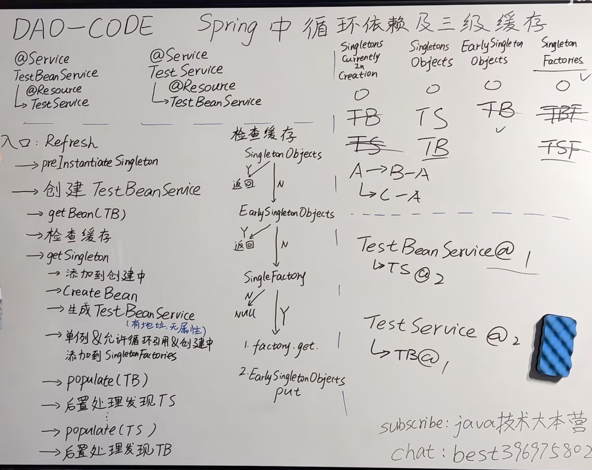
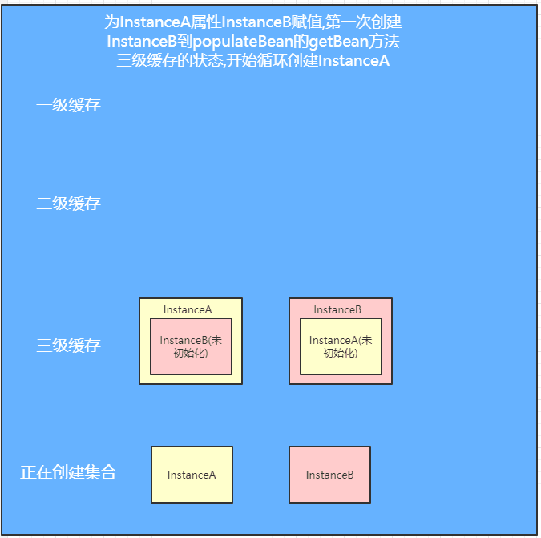
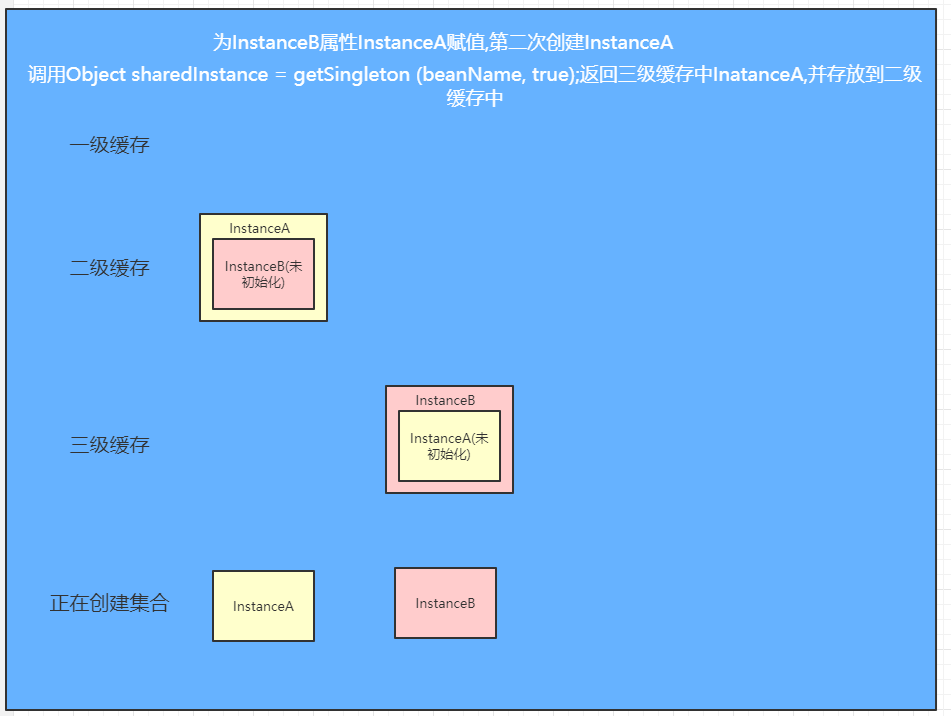
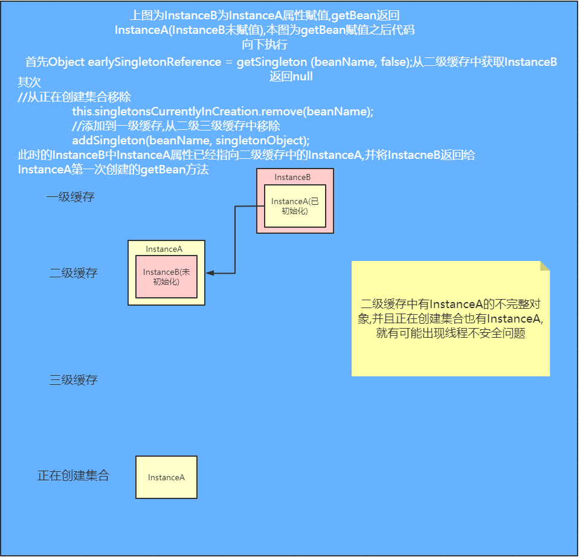
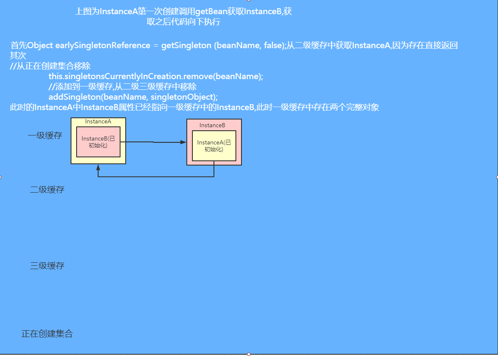

# Spring 三级缓存

Spring的三级缓存解决循环依赖问题

org.springframework.beans.factory.support.DefaultSingletonBeanRegistry

```java
	//一级缓存，用于存放完全初始化好的 bean，从该缓存中取出的 bean 可以直接使用
	/** Cache of singleton objects: bean name to bean instance. */
	private final Map<String, Object> singletonObjects = new ConcurrentHashMap<>(256);

	//二级缓存，提前曝光的单例对象的cache，存放原始的 bean 对象（尚未填充属性），用于解决循环依赖
	/** Cache of early singleton objects: bean name to bean instance. */
	private final Map<String, Object> earlySingletonObjects = new ConcurrentHashMap<>(16);

	//三级缓存，单例对象工厂的cache，存放 bean 工厂对象，用于解决循环依赖
	/** Cache of singleton factories: bean name to ObjectFactory. */
	private final Map<String, ObjectFactory<?>> singletonFactories = new HashMap<>(16);
```





<!-- more -->

## 创建

### Refresh

- preInstantiateSingleton
- 创建Bean
  - AbstractBeanFactory#doGetBean(BeanName)
  - 检查缓存
  - DefaultSingletonBeanRegistry#getSingleton()
    - 添加到创建中
    - CreateBean
    - 生成Bean(有地址无属性)
    - 单例&amp;允许循环引用&amp;创建中，添加到Singleton Factories
    - populate(Bean)
    - 后置处理发现Bean
    - populate(Bean)
    - 后置处理发现Bean


## 检查缓存

### SingletonObjects

### EarlySingletonObjects

### SingleFactory
- factory.get()
- EarlySingletonObjects.put()

## 对象创建的过程

1. `AbstractBeanFactory` 中的 `doGetBean()`方法

2. `DefaultSingletonBeanRegistry`中的 `getSingleton()`方法

   ```java
   protected Object getSingleton(String beanName, boolean allowEarlyReference) {
   		Object singletonObject = this.singletonObjects.get(beanName);
   		if (singletonObject == null && isSingletonCurrentlyInCreation(beanName)) {
   			synchronized (this.singletonObjects) {
   				singletonObject = this.earlySingletonObjects.get(beanName);
   				if (singletonObject == null && allowEarlyReference) {
   					ObjectFactory<?> singletonFactory=this.singletonFactories.get(beanName);
   					if (singletonFactory != null) {
   						singletonObject = singletonFactory.getObject();
   						this.earlySingletonObjects.put(beanName, singletonObject);
   						this.singletonFactories.remove(beanName);
   					}
   				}
   			}
   		}
   		return singletonObject;
   }
   ```

   - 先从一级缓存singletonObjects中去获取。（如果获取到就直接return）
   - 如果获取不到或者对象正在创建中（isSingletonCurrentlyInCreation()），那就再从二级缓存earlySingletonObjects中获取。（如果获取到就直接return)
   - 如果还是获取不到，且允许singletonFactories（allowEarlyReference=true）通过getObject()获取。就从三级缓存singletonFactory.getObject()获取。（如果获取到了就从singletonFactories中移除，并且放进earlySingletonObjects。其实也就是从三级缓存移动（是剪切、不是复制哦~）到了二级缓存）**此处的移动保证了，之后在init时候仍然是同一个对象**

3. AbstractAutowireCapableBeanFactory.createBean/doCreateBean()

   - 实例化

   ```java
   	// 使用构造器/工厂方法   instanceWrapper是一个BeanWrapper
   	instanceWrapper = createBeanInstance(beanName, mbd, args);
   	// 此处bean为"原始Bean"   也就是这里的A实例对象：A@1234
   	final Object bean = instanceWrapper.getWrappedInstance();
   ```

   - 添加到三级缓存

   ```java
   // 允许暴露，就把A绑定在ObjectFactory上，注册到三级缓存`singletonFactories`里面去保存着
   // Tips:这里后置处理器的getEarlyBeanReference方法会被促发，自动代理创建器在此处创建代理对象（注意执行时机 为执行三级缓存的时候）
   if (earlySingletonExposure) {
   	addSingletonFactory(beanName, () -> getEarlyBeanReference(beanName, mbd, bean));
   }
   //注意 此时加入的是一个factory没有执行 
   ```

4. 属性赋值

   ```java
   //此时候上面说到的getEarlyBeanReference方法就会被执行。这也解释为何我们@Autowired是个代理对象，而不是普通对象的根本原因
   
   populateBean(beanName, mbd, instanceWrapper);
   ```

- 解决循环依赖，在获取单例对象时singletonFactory.getObject()调用了

  ```java
  public abstract class AbstractAutoProxyCreator extends ProxyProcessorSupport
          implements SmartInstantiationAwareBeanPostProcessor, BeanFactoryAware {
      private final Map<Object, Object> earlyProxyReferences = new ConcurrentHashMap<>(16);
              
      @Override
      public Object getEarlyBeanReference(Object bean, String beanName) {
          Object cacheKey = getCacheKey(bean.getClass(), beanName);
          this.earlyProxyReferences.put(cacheKey, bean);
          /* 这里，主要就是看看到底要不要生成代理对象，要的话，就生成，不要就算了，另外，做了个标记：在earlyProxyReferences加了当前bean的key，表示：当前bean，已经被getEarlyBeanReference方法处理过了。
  
  /至于，最终到底有没有生成代理对象，另说。毕竟调用wrapIfNecessary也不是说，一定就满足切面，要生成代理对象。
  
  可能返回的仍然是原始对象。*/
          return wrapIfNecessary(bean, beanName, cacheKey);
      }        
  }   
  ```

  此处的SmartInstantiationAwareBeanPostProcessor继承自BeanPostProcessor

  BeanPostProcessor接口会在init阶段生成对对象的代理，`getCacheKey`保证不会重复生成代理对象

  

  1. 初始化对象

     > 如果有代理会检查是否发生了循环依赖

     ```java
     exposedObject = initializeBean(beanName, exposedObject, mbd);
     
     	... // 至此，相当于A@1234已经实例化完成、初始化完成（属性也全部赋值了~）
     	// 这一步我把它理解为校验：校验：校验是否有循环引用问题~~~~~
     
     	if (earlySingletonExposure) {
     		// 注意此处第二个参数传的false，表示不去三级缓存里singletonFactories再去调用一次getObject()方法了~~~
     		// 上面建讲到了由于B在初始化的时候，会触发A的ObjectFactory.getObject()  所以a此处已经在二级缓存earlySingletonObjects里了
     		// 因此此处返回A的实例：A@1234
     		Object earlySingletonReference = getSingleton(beanName, false);
     		if (earlySingletonReference != null) {
     		
     			// 这个等式表示，exposedObject若没有再被代理过，这里就是相等的
     			// 显然此处我们的a对象的exposedObject它是没有被代理过的  所以if会进去~
     			// 这种情况至此，就全部结束了~~~
     			if (exposedObject == bean) {
     				exposedObject = earlySingletonReference;
     			}
     	
     			// 继续以A为例，比如方法标注了@Aysnc注解，exposedObject此时候就是一个代理对象，因此就会进到这里来
     			//hasDependentBean(beanName)是肯定为true，因为getDependentBeans(beanName)得到的是["b"]这个依赖
     			else if (!this.allowRawInjectionDespiteWrapping && hasDependentBean(beanName)) {
     				String[] dependentBeans = getDependentBeans(beanName);
     				Set<String> actualDependentBeans = new LinkedHashSet<>(dependentBeans.length);
     
     				// A@1234依赖的是["b"]，所以此处去检查b
     				// 如果最终存在实际依赖的bean：actualDependentBeans不为空 那就抛出异常  证明循环引用了~
     				for (String dependentBean : dependentBeans) {
     					// 这个判断原则是：如果此时候b并还没有创建好，this.alreadyCreated.contains(beanName)=true表示此bean已经被创建过，就返回false
     					// 若该bean没有在alreadyCreated缓存里，就是说没被创建过(其实只有CreatedForTypeCheckOnly才会是此仓库)
     					if (!removeSingletonIfCreatedForTypeCheckOnly(dependentBean)) {
     						actualDependentBeans.add(dependentBean);
     					}
     				}
     				if (!actualDependentBeans.isEmpty()) {
     					throw new BeanCurrentlyInCreationException(beanName,
     							"Bean with name '" + beanName + "' has been injected into other beans [" +
     							StringUtils.collectionToCommaDelimitedString(actualDependentBeans) +
     							"] in its raw version as part of a circular reference, but has eventually been " +
     							"wrapped. This means that said other beans do not use the final version of the " +
     							"bean. This is often the result of over-eager type matching - consider using " +
     							"'getBeanNamesOfType' with the 'allowEagerInit' flag turned off, for example.");
     				}
     			}
     		}
     	}
     ```

### 是否可以没有二级缓存

 如果只在两个对象AB产生循环依赖时，可以不需要。

 但是如果是ABC产生循环依赖时

 ```java
 @Service
 public class TestService1 {
 
     @Autowired
     private TestService2 testService2;
     @Autowired
     private TestService3 testService3;
 
     public void test1() {
     }
 }
 
 @Service
 public class TestService2 {
 
     @Autowired
     private TestService1 testService1;
 
     public void test2() {
     }
 }
 
 @Service
 public class TestService3 {
 
     @Autowired
     private TestService1 testService1;
 
     public void test3() {
     }
 }
 ```

 TestService1注入到TestService3又需要从第三级缓存中获取实例，而第三级缓存里保存的并非真正的实例对象，而是`ObjectFactory`对象。说白了，两次从三级缓存中获取都是`ObjectFactory`对象，而通过它创建的实例对象每次可能都不一样的。

 这样不是有问题？

 为了解决这个问题，spring引入的第二级缓存。上面图1其实TestService1对象的实例已经被添加到第二级缓存中了，而在TestService1注入到TestService3时，只用从第二级缓存中获取该对象即可。

## 是否需要三级缓存

 如果创建的`Bean`有对应的`代理`，那其他对象注入时，注入的应该是对应的`代理对象`；但是`Spring`无法提前知道这个对象是不是有`循环依赖`的情况，而`正常情况`下（没有`循环依赖`情况），`Spring`都是在创建好`完成品Bean`之后才创建对应的`代理`。这时候`Spring`有两个选择：

  1. 不管有没有循环依赖，**都提前创建好代理对象**，并将代理对象放入缓存，出现循环依赖时，其他对象直接就可以取到代理对象并注入。
  2. 不提前创建好代理对象，在出现循环依赖被其他对象注入时，才实时生成代理对象。这样在没有循环依赖`的情况下，Bean就可以按着Spring设计原则的步骤来创建。

Spring`选择了第二种方式，那怎么做到提前曝光对象而又不生成代理呢？
Spring就是在对象外面包一层`ObjectFactory`，提前曝光的是`ObjectFactory`对象，在被注入时才在`ObjectFactory.getObject`方式内实时生成代理对象，并将生成好的代理对象放入到第二级缓存`Map<String, Object> earlySingletonObjects`。
`addSingletonFactory(beanName, () -> getEarlyBeanReference(beanName, mbd, bean));


## 模拟spring的getBean简易流程

首先是只有一级缓存

```java
public class Criculation {
  //一级缓存
  private static HashMap<String, Object> singletonMap = new HashMap<String, Object> ();
  //bean定义的Map
  private static HashMap<String, RootBeanDefinition> beanDefinitionMap = new HashMap<> ();

  public static void main(String[] args) throws Exception {
    // InstanceA和InstanceB两个beanDefinition
    RootBeanDefinition beanDefinitionA = new RootBeanDefinition (InstanceA.class);
    RootBeanDefinition beanDefinitionB = new RootBeanDefinition (InstanceB.class);
    //beanDefinitionMap存放beanDefinition
    beanDefinitionMap.put ("instanceA", beanDefinitionA);
    beanDefinitionMap.put ("instanceB", beanDefinitionB);
    Object instanceA = getBean ("instanceA");
    //        ((InstanceA)instanceA).hello ();
    ((InstanceB)singletonMap.get("instanceB")).getInstanceA ().hello ();
  }
  //getBean方法获取bean
  public static Object getBean(String beanName) throws Exception {
    //首先向一级缓存获取bean,如果获取到直接返回
    Object bean = singletonMap.get (beanName);
    if (bean != null) {
      return bean;
    }
    //从beanDefinitionMap中获取对应的beanDefinition
    RootBeanDefinition rootBeanDefinition = beanDefinitionMap.get (beanName);
    //因为是模拟,直接使用了无参构造器获取bean实例,此时bean属性没有赋值
    Class<?> beanClass = rootBeanDefinition.getBeanClass ();
    Object instanceBean = beanClass.newInstance ();
    Field[] declaredFields = beanClass.getDeclaredFields ();
    //这样解决循环依赖,最终得到的InstanceA的成员变量instanceB指向InstanceB而    
    //InstanceB的成员变量instanceA指向InstanceA形成了环
    //为什么解决了循环依赖,就是InstanceB再依赖InstanceA之前先从一级缓存中获取,此时的InstanceA只实例化,没有属性赋值,就是下面这个代码,在没有赋值之前就将InstanceA放到一级缓存中
    singletonMap.put (beanName, instanceBean);
    //遍历属性
    Arrays.stream (declaredFields).forEach (o -> {
      //如果属性标注了Autowired注解,则getBean获取实例    
      Annotation annotation = o.getAnnotation (Autowired.class);
      if (annotation != null) {
        try {
          Object beanField = getBean (o.getName ());
          //有可能是private
          o.setAccessible (true);
          //为属性赋值
          o.set (instanceBean, beanField);
        } catch (Exception e) {
          e.printStackTrace ();
        }
      }

    });
    //把bean放到一级缓存中,这段代码上面也有,如果放在上面可以解决循环依赖,如果不能理解,可以用debug的模式跟代码 就能明白
    //如果放在这的话,抛出栈溢出的异常
    singletonMap.put (beanName, instanceBean);
    return instanceBean;
  }
}
//两个循环依赖的类
@Data
class InstanceA {
  @Autowired
  private InstanceB instanceB;
  public  void hello(){
    System.out.println ("hello");
  }
}
@Data
class InstanceB {
  @Autowired
  private InstanceA instanceA;
}

```

两个类的关系如下图,红色部分为toString方法的异常,因为toString是要打印类实例化的信息,包含所有的成员变量,因为变量是相互的指向,所以调用toSting的时候,出现栈溢出错误


只有一级缓存有能力解决循环依赖,但是出现了不完整Bean的真空期(实例化后先放到容器中再赋值),如果是多线程的话,在一级缓存中可能获取到的bean是不完整的,可以考虑将不完整的bean放到二级缓存中.

```tsx
public class Criculation {
    //一级缓存
    private static HashMap<String, Object> singletonMap = new HashMap<String, Object> ();
    //二级缓存
    private static HashMap<String, Object> earlySingletonMap = new HashMap<String, Object> ();
    //bean定义的Map
    private static HashMap<String, RootBeanDefinition> beanDefinitionMap = new HashMap<> ();

    public static void main(String[] args) throws Exception {
        RootBeanDefinition beanDefinitionA = new RootBeanDefinition (InstanceA.class);
        RootBeanDefinition beanDefinitionB = new RootBeanDefinition (InstanceB.class);
        beanDefinitionMap.put ("instanceA", beanDefinitionA);
        beanDefinitionMap.put ("instanceB", beanDefinitionB);
        Object instanceA = getBean ("instanceA");
        ((InstanceA)instanceA).hello ();
    }
    public static Object getBean(String beanName) throws Exception {
        //一级缓存中获取完整bean
        if (singletonMap.containsKey (beanName)) {
            return singletonMap.get (beanName);
            //二级缓存中获取的bean为不完成的bean,解决循环依赖
        } else if (earlySingletonMap.containsKey (beanName)) {
            return earlySingletonMap.get (beanName);
        }
        RootBeanDefinition rootBeanDefinition = beanDefinitionMap.get (beanName);
        Class<?> beanClass = rootBeanDefinition.getBeanClass ();
        Object instanceBean = beanClass.newInstance ();
        Field[] declaredFields = beanClass.getDeclaredFields ();
        //将实例化但是没有属性赋值bean放到二级缓存中
        earlySingletonMap.put (beanName, instanceBean);
        Arrays.stream (declaredFields).forEach (o -> {
            Annotation annotation = o.getAnnotation (Autowired.class);
            if (annotation != null) {
                try {
                    Object beanField = getBean (o.getName ());
                    o.setAccessible (true);
                    o.set (instanceBean, beanField);
                } catch (Exception e) {
                    e.printStackTrace ();
                }
            }
        });
        //将完整的bean放到一级缓存中
        singletonMap.put (beanName, instanceBean);
        return instanceBean;
    }
}
@Data
class InstanceA {
    @Autowired
    private InstanceB instanceB;
    public void hello() {
        System.out.println ("hello");
    }
}
@Data
class InstanceB {
    @Autowired
    private InstanceA instanceA;
}
```

当然得到的结果和上面的图片是一样的.

下面是三级缓存,高度还原了spring的源码,源码中实例化和属性赋值都是通过bean的后置处理器实现的,为了解耦,本实例采用的是无参构造器反射实例化,赋值直接为@Autowired属性赋值,

DefaultBeanFactory类

```tsx
public class DefaultBeanFactory extends SingletonBeanRegistry {
//存放bean定义
    private final Map<String, RootBeanDefinition> beanDefinitionMap = new ConcurrentHashMap<> ();

    public void registerBeanDefinition(String beanName, RootBeanDefinition beanDefinition) {
        this.beanDefinitionMap.put (beanName, beanDefinition);
    }


    public Object getBean(String name) throws Exception {
        return doGetBean (name);
    }

    private <T> T doGetBean(String beanName) throws Exception {
        Object bean;
        //获取bean
        Object sharedInstance = getSingleton (beanName, true);
        if (sharedInstance != null) {
            bean = sharedInstance;
        } else {
//一级缓存没有bean,创建bean,首先获取bean定义
            RootBeanDefinition beanDefinition = this.beanDefinitionMap.get (beanName);
            if (beanDefinition == null) {
                throw new AssociationException ("can not find the definition of bean '" + beanName + "'");
            }
            //创建bean并属性赋值
            bean = getSingleton (beanName, () -> {
                try {
                    return doCreateBean (beanName, beanDefinition);
                } catch (BeansException ex) {
                    removeSingleton (beanName);
                    throw ex;
                }
            });
        }
        return ( T ) bean;
    }

    private Object doCreateBean(String beanName, RootBeanDefinition beanDefinition) throws BeansException {
        //创建实例,这里只是用了无参构造器
        Object bean = createBeanInstance (beanName, beanDefinition);
        boolean earlySingletonExposure = isSingletonCurrentlyInCreation (beanName);
        if (earlySingletonExposure) {
            addSingletonFactory (beanName, () -> bean);
        }
        Object exposedObject = bean;
        //属性赋值
        populateBean (beanName, beanDefinition, bean);
        if (earlySingletonExposure) {
            Object earlySingletonReference = getSingleton (beanName, false);
            if (earlySingletonReference != null) {
                exposedObject = earlySingletonReference;
            }
        }
        return exposedObject;
    }
/**    createBeanInstance方法在源码中的实现方式
 * AbstractAutowireCapableBeanFactory#createBeanInstance
    Constructor<?>[] ctors = determineConstructorsFromBeanPostProcessors(beanClass, beanName);获取构造函数
    autowireConstructor(beanName, mbd, ctors, null);通过有参构造创建bean实例(未初始化)
    instantiateBean(beanName, mbd);通过无参构造创建bean(未初始换)*/
    private Object createBeanInstance(String beanName, RootBeanDefinition beanDefinition) throws BeansException {
        Class<?> beanClass = beanDefinition.getBeanClass ();
        Constructor<?> constructorToUse;
        if (beanClass.isInterface ()) {
            throw new BeanCreationException ("Specified class '" + beanName + "' is an interface");
        }
        try {
            constructorToUse = beanClass.getDeclaredConstructor (( Class<?>[] ) null);
            constructorToUse.setAccessible (true);
            return constructorToUse.newInstance ();
        } catch (Exception e) {
            throw new BeanCreationException ("'" + beanName + "',No default constructor found", e);
        }
    }

    /**
     * 源码中populateBean方法是通过下面两个bean后置处理器为属性赋值
     AutowiredAnnotationBeanPostProcessor#postProcessProperties 为@Autowired和@Value赋值
     CommonAnnotationBeanPostProcessor#postProcessProperties    为@Resource赋值
     */
    private void populateBean(String beanName, RootBeanDefinition beanDefinition, Object beanInstance)  {
        Field[] beanFields = beanDefinition.getBeanClass ().getDeclaredFields ();
        Arrays.stream (beanFields).forEach (o -> {
            Annotation annotation = o.getAnnotation (Autowired.class);
            if (annotation != null) {
                try {
                    Object beanField = getBean (o.getName ());
                    o.setAccessible (true);
                    o.set (beanInstance, beanField);
                } catch (Exception e) {
                    e.printStackTrace ();
                }
            }
        });
    }
}
```

SingletonBeanRegistry类

```kotlin
public class SingletonBeanRegistry {

    private static final Object NULL_OBJECT = new Object();
//一级缓存
    private final Map<String, Object> singletonObjects = new ConcurrentHashMap<>();
//二级缓存
    private final Map<String, Object> earlySingletonObjects = new HashMap<>();
//三级缓存
    private final Map<String, ObjectFactory<?>> singletonFactories = new HashMap<>();
//正在创建标识
    private final Set<String> singletonsCurrentlyInCreation = Collections.newSetFromMap(new ConcurrentHashMap<>());

    protected Object getSingleton(String beanName,boolean allowEarlyReference)  {
        //从一级缓存获取完整bean
        Object singletonObject = this.singletonObjects.get(beanName);
        //一级缓存为空,并且正在创建,出现循环依赖的情况
        if (singletonObject == null && isSingletonCurrentlyInCreation(beanName)) {
            synchronized (this.singletonObjects) {
                //从二级缓存中获取
                singletonObject = this.earlySingletonObjects.get(beanName);
                //二级缓存为空,allowEarlyReference为true 利用三级缓存创建bean
                if (singletonObject == null && allowEarlyReference) {
                    //从三级缓存获取
                    ObjectFactory<?> singletonFactory = this.singletonFactories.get(beanName);
                    //如果不为空
                    if (singletonFactory != null) {
                        //调用了函数接口,其实也是直接返回bean
                        singletonObject = singletonFactory.getObject();
                        //存放进二级缓存,这里及存在了线程安全问题
                        this.earlySingletonObjects.put(beanName, singletonObject);
                        //从三级缓存中移除
                        this.singletonFactories.remove(beanName);
                    }
                }
            }
        }
        return (singletonObject != NULL_OBJECT ? singletonObject : null);
    }

    protected Object getSingleton(String beanName, ObjectFactory<?> singletonFactory)  {
        synchronized (this.singletonObjects) {
            //从一级缓存中获取
            Object singletonObject = this.singletonObjects.get(beanName);
            if (singletonObject == null) {
                //添加到正在创建集合
                this.singletonsCurrentlyInCreation.add(beanName);
                //调用doCreateBean方法
                singletonObject = singletonFactory.getObject();
                //从正在创建集合移除
                this.singletonsCurrentlyInCreation.remove(beanName);
                //添加到一级缓存,从二级三级缓存中移除
                addSingleton(beanName, singletonObject);
            }
            return (singletonObject != NULL_OBJECT ? singletonObject : null);
        }
    }

    protected void addSingleton(String beanName, Object singletonObject) {
        synchronized (this.singletonObjects) {
            this.singletonObjects.put(beanName, (singletonObject != null ? singletonObject : NULL_OBJECT));
            this.singletonFactories.remove(beanName);
            this.earlySingletonObjects.remove(beanName);
        }
    }

    protected void addSingletonFactory(String beanName, ObjectFactory<?> singletonFactory) {
        synchronized (this.singletonObjects) {
            if (!this.singletonObjects.containsKey(beanName)) {
                this.singletonFactories.put(beanName, singletonFactory);
                this.earlySingletonObjects.remove(beanName);
            }
        }
    }

    protected void removeSingleton(String beanName) {
        synchronized (this.singletonObjects) {
            this.singletonObjects.remove(beanName);
            this.singletonFactories.remove(beanName);
            this.earlySingletonObjects.remove(beanName);
        }
    }

    protected boolean isSingletonCurrentlyInCreation(String beanName) {
        return this.singletonsCurrentlyInCreation.contains(beanName);
    }

}
```

测试代码

```java
public class MainTest {
    public static void main(String[] args) throws Exception {
        RootBeanDefinition beanDefinitionA = new RootBeanDefinition();
        beanDefinitionA.setBeanClass (InstanceA.class);
        RootBeanDefinition beanDefinitionB = new RootBeanDefinition();
        beanDefinitionB.setBeanClass (InstanceB.class);
        DefaultBeanFactory defaultBeanFactory = new DefaultBeanFactory ();
        defaultBeanFactory.registerBeanDefinition ("instanceA",beanDefinitionA);
        defaultBeanFactory.registerBeanDefinition ("instanceB",beanDefinitionB);
        Object instanceA = defaultBeanFactory.getBean ("instanceA");
    }
}
@Data
class InstanceA {
    @Autowired
    private InstanceB instanceB;

    public InstanceA() {
        System.out.println ("InstanceA初始化");
    }
}
@Data
class InstanceB {
    @Autowired
    private InstanceA instanceA;
    public InstanceB() {
        System.out.println ("InstanceB初始化");
    }
}
```

第三级缓存都是存放的lambda表达式,也是解耦
代码的分析用下面的图简单的讲解一下,可以结合debuger 一点点调试










在第四张图如果此时线程2创建InstanceA的话,二级缓存中有不完整的实例,并且正在创建队列中含有InstanceA
Object sharedInstance = getSingleton (beanName, true);直接返回的就是InstanceA的不完成实例所以使用synchronized加锁,保证线程安全.
一级缓存和三级缓存不管是否是循环依赖都要使用,只要在循环依赖的情况下才会使用到二级缓存,加锁的方式防止多线程从二级缓存中获取没有初始化好的类.


###### 来源:

https://www.bilibili.com/video/BV1Fa411j7kc

https://www.jianshu.com/p/491e20cf7968

https://blog.csdn.net/weixin_40133204/article/details/122029228
