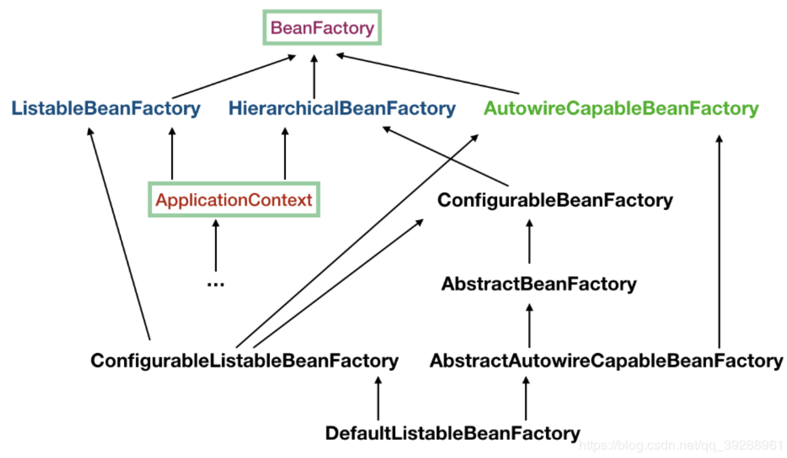

# Spring 层次性依赖查找Bean



<!-- more -->

### 层次性依赖查找接口 - HierarchicalBeanFactory

- 双亲 BeanFactory:getParentBeanFactory()

  ### 层次性查找

- 根据 Bean 名称查找

  - 基于 containsLocalBean 方法实现

- 根据 Bean 类型查找实例列表

  - 单一类型:BeanFactoryUtils#beanOfType
  - 集合类型:BeanFactoryUtils#beansOfTypeIncludingAncestors

- 根据 Java 注解查找名称列表

  - BeanFactoryUtils#beanNamesForTypeIncludingAncestors

```java
public class DemoApplication {
  public static void main(String[] args) {
    AnnotationConfigApplicationContext ac=new AnnotationConfigApplicationContext();
    ac.register(Config1.class);
    ac.refresh();
    ConfigurableListableBeanFactory beanFactory = ac.getBeanFactory();
    System.out.println("父容器"+beanFactory.getParentBeanFactory()); //null
    //层级的BeanFactory,创建一个父容器
    HierarchicalBeanFactory parentBeanFactory = createBeanFactory();
    displayBean(beanFactory,"test");
    displayBean(parentBeanFactory,"superTest");
    //设置父容器
    beanFactory.setParentBeanFactory(parentBeanFactory);
    displayBean(beanFactory,"superTest");
    displayBean(parentBeanFactory,"test");
    //递归查找Bean,双亲委派，先去父容器查找（parentBeanFactory），找不到最后去本地容器（beanFactory）查找
    displayContainsBean(beanFactory,"superTest");
    displayContainsBean(parentBeanFactory,"superTest");
    ac.close();
  }
  private static void displayBean(HierarchicalBeanFactory beanFactory,String beanName){
    System.out.println(beanFactory.containsLocalBean(beanName));
  }
  private static void displayContainsBean(HierarchicalBeanFactory beanFactory,String beanName){
    System.out.println(containsBean(beanFactory,beanName));
  }
  private static boolean containsBean(HierarchicalBeanFactory beanFactory,String beanName){
    BeanFactory parentBeanFactory = beanFactory.getParentBeanFactory();
    if(parentBeanFactory instanceof HierarchicalBeanFactory){
      HierarchicalBeanFactory hierarchicalBeanFactory = HierarchicalBeanFactory.class.cast(parentBeanFactory);
      if(containsBean(hierarchicalBeanFactory,beanName)){
        return true;
      }
    }
    return beanFactory.containsLocalBean(beanName);
  }
  private static HierarchicalBeanFactory createBeanFactory(){
    AnnotationConfigApplicationContext ac=new AnnotationConfigApplicationContext();
    ac.register(Config.class);
    ac.refresh();
    return ac.getBeanFactory();
  }
}
```


###### 来源:

https://rumenz.com/rumenbiji/Spring-HierarchicalBean.html
