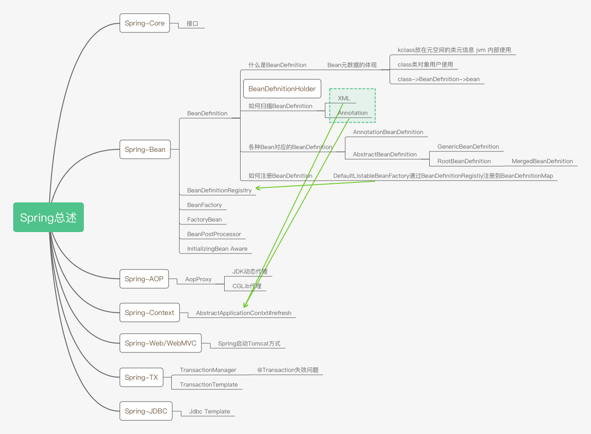

# Spring-总述

<!-- more -->

## Spring-Core

接口

## Spring-Bean

### BeanDefinition 

`BeanDefinitionHolder`

- 什么是BeanDefinition
  - Bean元数据的体现
    - kclass放在元空间的类元信息&nbsp;jvm&nbsp;内部使用
    - class类对象用户使用
    - class-&gt;BeanDefinition-&gt;bean

#### 如何扫描BeanDefinition

- XML
- Annotation

#### 各种Bean对应的BeanDefinition

- AnnotationBeanDefinition
- AbstractBeanDefinition
  - GenericBeanDefinition
  - RootBeanDefinition
    - MergedBeanDefinition

#### 如何注册BeanDefinition

DefaultListableBeanFactory通过BeanDefinitionRegistiy注册到BeanDefinitionMap

### BeanDefinitionRegisitry

### BeanFactory

### FactoryBean

### BeanPostProcessor

### InitializingBean Aware

## Spring-AOP

- AopProxy
  - JDK动态代理
  - CGLib代理

## Spring-Context

AbstractApplicationContxt#refresh

## Spring-Web/WebMVC

Spring启动Tomcat方式

## Spring-TX

- TransactionManager
  - @Transaction失效问题
- TransactionTemplate

## Spring-JDBC

Jdbc Template
