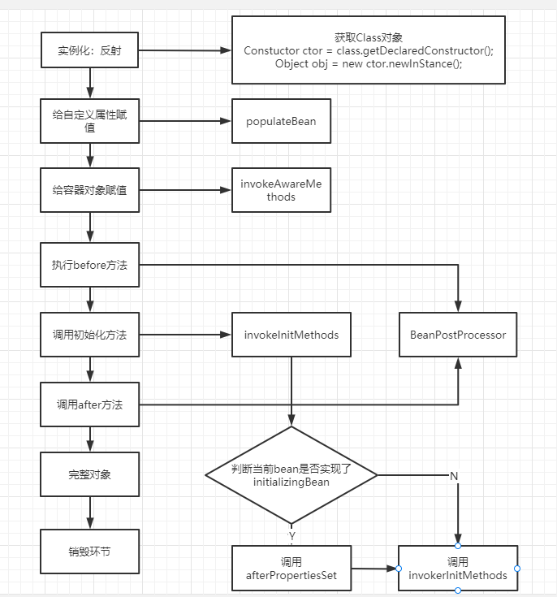
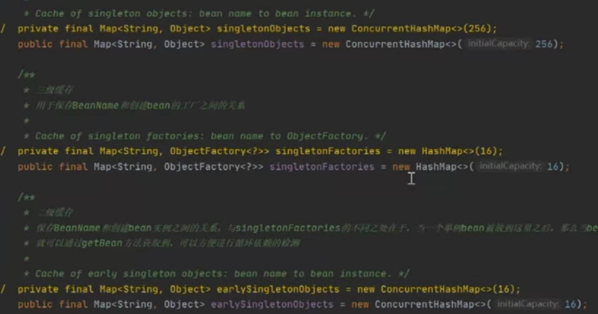

# Spring IOC

- IOC：控制反转，传统使用对象的时候，对象时由使用者控制的，有了Spring之后，可以将整个对象交给容器来帮我们进行管理

  

- DI：依赖注入，将对象的属性注入到具体的对象中，通过@Autowired、@Resource、populateBean方法来完成注入

  

- 容器：负责存储对象，使用map结构存储对象，在Spring中存储对象的时候一般有三级缓存：

  SingletonObjects存放完整对象、earlySingtonObjects存放半成品对象，SingletonFactory用来存放lambda表达式和对象名称的映射，整个bean的生命周期，从创建到使用到销毁，各个环节都是容器帮我们控制的。

  

- Spring中所有bean都是通过反射生成的,constructor，newInstance，在整个流程中还包含很多扩展点，比如有两个非常重要的接口，BeanFactoryProcessor，BeanPostProcessor，用来实现扩展功能，aop就是在ioc基础之上的一个扩展实现，是通过BeanPostProcessor实现的，Ioc中除了创建对象之后还有一个重点的点就是填充属性

<!-- more -->

# Springbean的生命周期

Spring容器来帮我们控制对象，从对象的产生到销毁的环节都是由容器来控制的

- 实例化Bean对象，通过反射的方式来生成，在源码中有一个createBeanInstance的方法是专门来生成对象的

- 当bean对象创建完成之后，对象的属性值都是默认值，所有要开始给bean填充属性，通过populateBean方法来完成对象属性的填充，这中间会涉及到循环依赖

- 向bean对象中设置容器属性，调用invokerAwareMethods方法来将容器对象设置到具体的bean对象中

- 调用BeanPostProcessor中的前置处理方法来进行bean对象的扩展工作，ApplicationContextPostProcessor，EmbeddValueResolver等对象

- 调用invokerInitMethods方法来完成初始化方法的调用，在此方法处理过程中，需要判断当前bean对象是否实现了InitializingBean接口，如果实现了调用afterPropertiesSet方法来最后设置Bean对象

- 调用BeanPostProcessor的后置处理方法，完成对Bean对象的后置处理工作，aop就是在此处实现的，实现的接口实现名字：AbstractAutoProxyCreator

- 获取到完整对象，通过getBean的方式去进行对象的获取和使用

- 当对象使用完成后，容器在关闭的时候，会销毁对象，首先判断是否实现了DispossableBean接口，然后去调用destoryBeanMethord方法

# BeanFactory和FactoryBean的区别

BeanFactory和FactoryBean都可以用来创建对象，只不过创建的流程和方式不同

- 当使用BeanFactory的时候，必须要严格遵守bean的生命周期，经过一系列繁杂的步骤之后才可以创建出单例的对象，是流水线式的创建过程

  

- FactoryBean是用户可以自定义bean对象的创建流程，不需要按照bean的生命周期来创建，在此接口中包含三个方法：

  - isSingleton：判断是否是单例对象
  - getObjectType：获取对象的类型
  - getObject：在此方法中可以自己创建对象，使用new的方式或者使用代理方式都可以，用户可以按照自己的需要随意去创建对象，在很多框架集成的时候都会实现factoryBean接口，比如Feign

# Spring中使用到的设计模式

- 单例模式：Spring中bean都是单例的

- 工厂模式：BeanFactory

- 模板方法模式：postProcessorBeanFactory、各种template

- 观察者模式：listener、event、multicast

- 适配器模式：Adapter

- 装饰者模式：BeanWrapper

- 责任链模式：aop中会使用一个责任链模式

- 代理模式：aop动态代理

- 策略模式：xmlBeanDefinitionReader、PropertiesBeanDefinitionReader

# ApplicationContext和BeanFactory的区别

BeanFactory是访问Spring容器的根接口，里面只是提供了某些基本方法的约束和规范

ApplicationContext，为了满足更多需求，ApplicationContext实现了BeanFactory接口，并在此接口的基础之上做了一些扩展功能，提供了更丰富的api调用

一般我们在使用的时候用ApplicationContext更多

# Spring如何解决循环依赖

Spring的bean对象的创建都要经历实例化和初始化（属性填充）的过程，通过将对象的状态分开，存在半成品和成品对象的方式来分别进行初始化和实例化；

成品和半成品在存储的时候需要分不同的缓存来进行存储

缓存存储在DefaultSingletonBeanRegistry

## 只有一级缓存是否可行？（一级缓存：singletonObjects）

不行，会把成品状态的bean对象和半成品状态的bean对象放在一起，而半成品对象时无法暴露给外部使用的

所以，一级缓存放成品，二级缓存放半成品

## 只有二级缓存行不行？（二级缓存：earlySingletonObjects）

如果整个应用程序中不设计aop的存在，那么二级缓存足以解决循环依赖问题，如果aop中存在循环依赖，那么久必须使用三级缓存

## 为什么需要三级缓存？（三级缓存：singletonFactoryies）

三级缓存的value类型是ObjectFactory，是一个函数表达式接口，不是直接进行调用的，只有在调用getObject方法的时候才会去调用里面存储的lambda表达式，存在的意义是

保证在整个容器的运行过程中同名的bean对象只有一个

如果一个对象被代理，或者需要生成代理对象，那么要不要生成一个原始对象？要

当创建出代理对象之后，会同时存在代理对象和普通对象，那么此时该选用哪一个？

当需要代理对象的时候，或者代理对象生成的时候必须要覆盖原始对象，也就是说整个容器中有且仅有一个bean对象

在实际调用过程中，是没有办法来确定什么时候对象需要被调用的，因此当某一个对象被调用的时候，优先判断当前对象是否需要被代理，类似于回调机制，当获取对象之后根据传入的lambda表达式来确定返回的是哪一个确定的对象，如果条件符合，返回代理对象，如果不符合则返回原始对象

