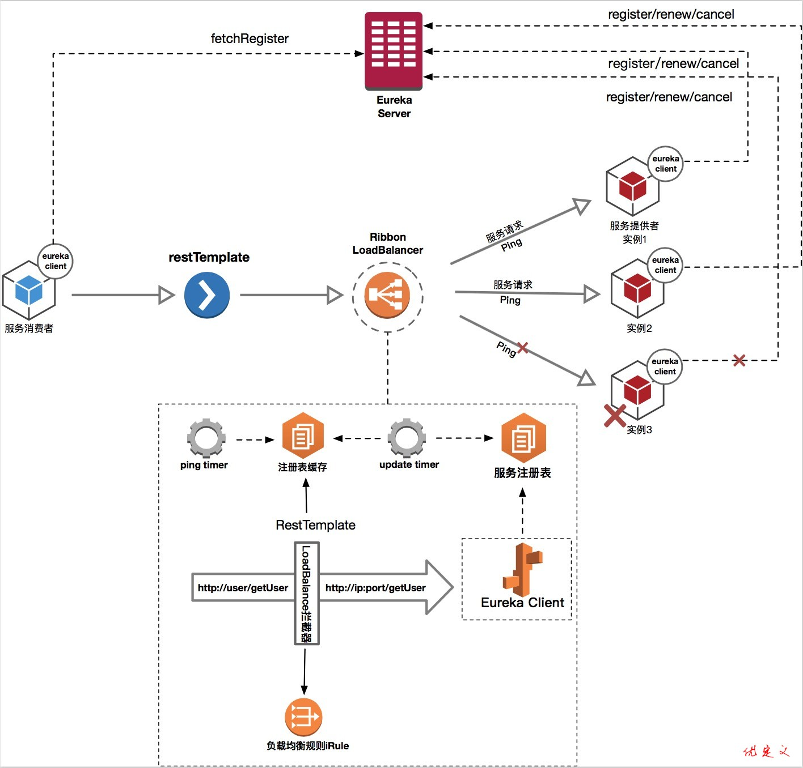
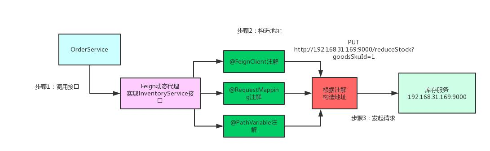

# 什么是微服务架构

微服务架构就是将单体的应用程序分成多个应用程序，这多个应用程序就成为微服务，每个微服务运行在自己的进程中，并使用轻量级的机制通信。这些服务围绕业务能力来划分，并通过自动化部署机制来独立部署。这些服务可以使用不同的编程语言，不同数据库，以保证最低限度的集中式管理。

## Spring Cloud 是什么

- Spring Cloud是一系列框架的有序集合。它利用Spring Boot的开发便利性巧妙地简化了分布式系统基础设施的开发，如服务发现注册、配置中心、智能路由、消息总线、负载均衡、断路器、数据监控等，都可以用Spring Boot的开发风格做到一键启动和部署。
- Spring Cloud并没有重复制造轮子，它只是将各家公司开发的比较成熟、经得起实际考验的服务框架组合起来，通过Spring Boot风格进行再封装屏蔽掉了复杂的配置和实现原理，最终给开发者留出了一套简单易懂、易部署和易维护的分布式系统开发工具包。

## 什么是Spring Cloud Alibaba？

Spring Cloud Alibaba 套件，阿里开源组件、阿里云商业组件整合进 Spring Cloud 体系当中，同时对 Spring Cloud Gateway、OpenFeign、Ribbon 等等进行集成。
主要功能如下：

- 服务注册与发现：适配 Spring Cloud 服务注册与发现标准，默认集成了 Ribbon 的支持。
- 分布式配置管理：支持分布式系统中的外部化配置，配置更改时自动刷新。
- 服务限流降级：默认支持 WebServlet、WebFlux, OpenFeign、RestTemplate、Spring Cloud Gateway, Zuul, Dubbo 和 RocketMQ 限流降级功能的接入，可以在运行时通过控制台实时修改限流降级规则，还支持查看限流降级 Metrics 监控。
- 消息驱动能力：基于 Spring Cloud Stream 为微服务应用构建消息驱动能力。
- 分布式事务：使用 @GlobalTransactional 注解， 高效并且对业务零侵入地解决分布式事务问题。

## Spring Cloud Alibaba和Spring Cloud 的区别和联系 

Spring Cloud Alibaba是Spring Cloud的子项目，Spring Cloud Alibaba符合Spring Cloud标准。
随着Spring Cloud Netflix下的相关组件逐步进入维护模式，进入维护模式的意思就是从目前一直到以后一段时间Spring Cloud Netflix提供的服务和功能就这么多了，不再开发新的组件和功能了。同时Spring Cloud官方也在积极孵化其他替代品，以满足Spring Cloud版本迭代的需求。
Spring Cloud Alibaba生态下的各个组件其实在国内很多公司很早之前就有使用，它们在服务治理方面比Spring Cloud Netflix更加强大，而且比较符合国内互联网公司的业务特性，推荐使用。

<!-- more -->

## Spring Cloud Alibaba 套件对比

Spring Cloud Alibaba 套件，阿里开源组件、阿里云商业组件整合进 Spring Cloud 体系当中，同时对 Spring Cloud Gateway、OpenFeign、Ribbon 等等进行集成。
主要功能如下：

- 服务注册与发现：适配 Spring Cloud 服务注册与发现标准，默认集成了 Ribbon 的支持。
- 分布式配置管理：支持分布式系统中的外部化配置，配置更改时自动刷新。
- 服务限流降级：默认支持 WebServlet、WebFlux, OpenFeign、RestTemplate、Spring Cloud Gateway, Zuul, Dubbo 和 RocketMQ 限流降级功能的接入，可以在运行时通过控制台实时修改限流降级规则，还支持查看限流降级 Metrics 监控。
- 消息驱动能力：基于 Spring Cloud Stream 为微服务应用构建消息驱动能力。
- 分布式事务：使用 @GlobalTransactional 注解， 高效并且对业务零侵入地解决分布式事务问题。

|            | SpringCloud 官方                                         | Netflix  | Alibaba                      |
| :--------- | :------------------------------------------------------- | :------- | ---------------------------- |
| 配置中心   | Spring Cloud Config、Spring Cloud Vault                  | Archaius | Nacos                        |
| 注册中心   |                                                          | Eureka   | Nacos                        |
| 服务调用   | Spring Cloud OpenFeign、RestTemlete                      |          | Dubbo                        |
| 负载均衡   | Spring Cloud Load Balancer                               | Ribbon   | Dubbo                        |
| 服务容错   |                                                          | Hystrix  | Sentinel                     |
| API网关    | Spring Cloud Gateway                                     | Zuul     |                              |
| 消息驱动   | Spring Cloud Stream RabbiltMQ、Spring Cloud Stream Kafka |          | Spring Cloud Stream RecketMQ |
| 事件总线   | Spring Cloud Bus                                         |          | Spring Cloud Bus RecketMQ    |
| 链路跟踪   | Spring Cloud Sleuth                                      |          |                              |
| 分布式事物 |                                                          |          | Seate                        |
| 分布式调度 |                                                          |          | SchedulerX                   |


## SpringCloud的优缺点

### 优点

- 每一个服务足够内聚,代码容易理解
- 开发效率提高，一个服务只做一件事
- 微服务能够被小团队单独开发
- 微服务是松耦合的，是有功能意义的服务
- 可以用不同的语言开发,面向接口编程
- 易于与第三方集成
- 微服务只是业务逻辑的代码，不会和 HTML、CSS 或者其他界面组合
- 可以灵活搭配,连接公共库/连接独立库

### 缺点

- 分布式系统的负责性
- 多服务运维难度，随着服务的增加，运维的压力也在增大
- 系统部署依赖
- 服务间通信成本
- 数据一致性
- 系统集成测试
- 性能监控

## SpringBoot和SpringCloud的区别？

- SpringBoot专注于快速方便的开发单个个体微服务。
- SpringCloud是关注全局的微服务协调整理治理框架，它将SpringBoot开发的一个个单体微服务整合并管理起来，
- 为各个微服务之间提供，配置管理、服务发现、断路器、路由、微代理、事件总线、全局锁、决策竞选、分布式会话等等集成服务
- SpringBoot可以离开SpringCloud独立使用开发项目， 但是SpringCloud离不开SpringBoot ，属于依赖的关系
- SpringBoot专注于快速、方便的开发单个微服务个体，SpringCloud关注全局的服务治理框架。

## 使用 Spring Boot 开发分布式微服务时，面临什么问题

- （1）与分布式系统相关的复杂性-这种开销包括网络问题，延迟开销，带宽问题，安全问题。
- （2）服务发现-服务发现工具管理群集中的流程和服务如何查找和互相交谈。它涉及一个服务目录，在该目录中注册服务，然后能够查找并连接到该目录中的服务。
- （3）冗余-分布式系统中的冗余问题。
- （4）负载平衡 --负载平衡改善跨多个计算资源的工作负荷，诸如计算机，计算机集群，网络链路，中央处理单元，或磁盘驱动器的分布。
- （5）性能-问题 由于各种运营开销导致的性能问题。

## Spring Cloud 和Dubbo区别?

- （1）服务调用方式：dubbo是RPC springcloud Rest Api
- （2）注册中心：dubbo 是zookeeper springcloud是eureka，也可以是zookeeper
- （3）服务网关，dubbo本身没有实现，只能通过其他第三方技术整合，springcloud有Zuul路由网关，作为路由服务器，进行消费者的请求分发,springcloud支持断路器，与git完美集成配置文件支持版本控制，事物总线实现配置文件的更新与服务自动装配等等一系列的微服务架构要素。


# 注册中心

## 什么是服务注册中心？

服务注册中心就是服务实现服务化的核心组件，类似于目录服务的作用，主要用来存储服务信息。服务注册中心是SOA架构中最基础的设施之一。

## 服务注册中心的作用

#### 服务注册

服务注册就是将开发好的调用方(Consumer)获得服务方(Provider)服务进行注册进注册中心，通过注册中心，存储调用方(Consumer)获得服务方(Provider)的地址，从而能够调用。

例如：服务注册中心是一栋写字楼的物业，注册入这栋写字楼的公司都是服务方/调用方，当我们需要找到这栋写字楼的某一个公司，就可以直接去物业找到具体的地址。

#### 服务发现

调用方(Consumer)根据服务方提供的入口在服务注册中心寻找相对应的函数，可进行远程调用。**调用方(Consumer)/服务方(Provider)可以是任意注册中心中的服务。**

##### 服务发现

在微服务架构中一个业务流程需要多个微服务通过网络接口调用完成业务处理，服务消费方从服务注册中心获取服 务提供方的地址，从而进行远程调用，这个过程叫做服务发现。

服务发现流程：
服务实例本身并不记录服务生产方的网络地址，所有服务实例内部都会包含服务发现客户端。

在每个服务启动时会向服务发现中心上报自己的网络位置。在服务发现中心内部会形成一个服务注册表，服务注册表是服务发现的核心部分，是包含所有服务实例的网络地址的数据库。

服务发现客户端会定期从服务发现中心同步服务注册表 ，并缓存在客户端。

当需要对某服务进行请求时，服务实例通过该注册表，定位目标服务网络地址。若目标服务存在多个网络地址，则使用负载均衡算法从多个服务实例中选择出一个，然后发出请求。

总结，在微服务环境中，由于服务运行实例的网络地址是不断动态变化的，服务实例数量的动态变化 ，因此无法使用固定的配置文件来记录服务提供方的网络地址，必须使用动态的服务发现机制用于实现微服务间的相互感知。 各服务实例会上报自己的网络地址，这样服务中心就形成了一个完整的服务注册表，各服务实例会通过服务发现中心来获取访问目标服务的网络地址，从而实现服务发现的机制。

执行流程：

服务提供方将自己注册到服务注册中心
服务消费方从注册中心获取服务地址
进行远程调用

##### 服务发现产品对比

目前市面上用的比较多的服务发现中心有：Nacos、Eureka、Consul和Zookeeper。

| 对比项目        | Naos                       | Eureka      | Consul            | Zookeeper  |
| --------------- | -------------------------- | ----------- | ----------------- | ---------- |
| 一致性协议      | 支持AP和CP模型             | AP模型      | CP模型            | CP模型     |
| 健康检查        | TCP/HTTP/MYSQL/Client Beat | Client Beat | TCP/HTTP/gRPC/Cmd | Keep Alive |
| 负载均衡策略    | 权重/metadata/Selector     | Ribbon      | Fabio             | -          |
| 雪崩保护        | 有                         | 有          | 无                | 无         |
| 自动注销实例    | 支持                       | 支持        | 不支持            | 支持       |
| 访问协议        | HTTP/DNS                   | HTTP        | HTTP/DNS          | TCP        |
| 监听支持        | 支持                       | 支持        | 支持              | 支持       |
| 多数据中心      | 支持                       | 支持        | 支持              | 不支持     |
| 跨注册中心同步  | 支持                       | 不支持      | 支持              | 不支持     |
| SpringCloud集成 | 支持                       | 支持        | 支持              | 不支持     |
| Dubbo集成       | 支持                       | 不支持      | 不支持            | 支持       |
| k8s集成         | 支持                       | 不支持      | 支持              | 不支持     |

## 

## Nacos

### 什么是Nacos

阿里的一个开源产品，是针对微服务架构中的服务发现、配置管理、服务治理的综合型解决方案。

（用来实现配置中心和服务注册中心）

#### 介绍Nacos功能

服务发现和服务健康监测（使服务更容易注册，并通过DNS或HTTP接口发现其他服务，还提供服务的实时健康检查，以防 止向不健康的主机或服务实例发送请求。 ）

支持基于DNS和基于RPC的服务发现。服务提供者使用原生SDK、OpenAPI、或一个独立的Agent TODO注册 Service 后，服务消费者可以使用DNS TODO 或HTTP&API查找和发现服务。
Nacos提供对服务的实时的健康检查，阻止向不健康的主机或服务实例发送请求。Nacos 支持传输层 (PING 或 TCP)和应用层 (如 HTTP、MySQL、用户自定义）的健康检查。 对于复杂的云环境和网络拓扑环境中（如 VPC、边缘网络等）服务的健康检查，Nacos 提供了 agent 上报模式和服务端主动检测2种健康检查模式。Nacos 还提供了统一的健康检查仪表盘，帮助您根据健康状态管理服务的可用性及流量。

#### 动态配置服务

以中心化、外部化和动态化的方式管理所有环境的应用配置和服务配置。
消除了配置变更时重新部署应用和服务的需要，让配置管理变得更加高效和敏捷。
配置中心化管理让实现无状态服务变得更简单，让服务按需弹性扩展变得更容易。
提供了一个简洁易用的UI (控制台样例 Demo) 帮助管理所有的服务和应用的配置。
Nacos 还提供包括配置版本跟踪、金丝雀发布、一键回滚配置以及客户端配置更新状态跟踪在内的一系列开箱即用的配置管理特性，能更安全地在生产环境中管理配置变更和降低配置变更带来的风险。

#### 动态 DNS 服务

动态 DNS 服务支持权重路由，更容易地实现中间层负载均衡、更灵活的路由策略、流量控制以及数据中心内网的简单DNS解析服务。动态DNS服务还能更容易地实现以 DNS 协议为基础的服务发现，消除耦合到厂商私有服务发现 API 上的风险。
Nacos 提供了一些简单的 DNS APIs TODO ，管理服务的关联域名和可用的 IP:PORT 列表

#### 服务及其元数据管理

从微服务平台建设的视角管理数据中心的所有服务及元数据，包括管理服务的描述、生命周期、服务的静态依赖分析、服务的健康状态、服务的流量管理、路由及安全策略、服务的 SLA 以及最首要的 metrics 统计数据。

## Nacos和Eureka：

### Nacos的服务实例分为两种类型：

- 临时实例：如果实例宕机超过一定时间，会从服务列表剔除，默认的类型。
- 非临时实例：如果实例宕机，不会从服务列表剔除，也可以叫永久实例。

```yaml
spring:
	cloud:
		nacos:
			discovery:
				ephemeral: false # true:临时实例，false：非临时实例，永久实例
```

### Nacos与eureka的共同点

1. 都支持服务注册和服务拉取
2. 都支持服务提供者心跳方式做健康检测

### Nacos与Eureka的区别

1. Nacos支持服务端主动检测提供者状态：临时实例采用心跳模式，非临时实例采用主动检测模式：【正式工每天都会被检查状态，临时工也就心跳检测自己上报状态】
2. 临时实例心跳不正常会被剔除，非临时实例【正式工】则不会被剔除
3. Nacos支持服务列表变更的消息推送模式，服务列表更新更及时
4. Nacos集群默认采用AP(可用)方式，当集群中存在非临时实例时，采用CP(一致性)模式；Eureka采用AP(可用)方式

**Consul**

Consul 是 HashiCorp 公司推出的开源工具，用于实现分布式系统的服务发现与配置。
Consul 使用 Go 语言编写，因此具有天然可移植性（支持 Linux、Windows 和 Mac OS X）。
Consul 内置了服务注册与发现框架、分布一致性协议实现、健康检查、Key/Value 存储、多数据中心方案，不再需要依赖其他工具（比如 ZooKeeper 等），使用起来也较为简单。
Consul 遵循 CAP 原理中的 CP 原则，保证了强一致性和分区容错性，且使用的是 Raft 算法，比 ZooKeeper 使用的 Paxos 算法更加简单。
虽然保证了强一致性，但是可用性就相应下降了，例如服务注册的时间会稍长一些，因为 Consul 的 Raft 协议要求必须过半数的节点都写入成功才认为注册成功。
在 Leader 挂掉了之后，重新选举出 Leader 之前会导致 Consul 服务不可用。

**Zookeeper**

Zookeeper实际上是yahoo开发的，用于分布式中一致性处理的框架。最初其作为研发Hadoop时的副产品。由于分布式系统中一致性处理较为困难，其他的分布式系统没有必要费劲重复造轮子，故随后的分布式系统中大量应用了zookeeper，以至于zookeeper成为了各种分布式系统的基础组件，其地位之重要，可想而知。著名的hadoop、kafka、dubbo 都是基于zookeeper而构建。 ZooKeeper 使用的 Paxos 算法，当 Master 节点因为网络故障与其他节点失去联系时，剩余节点会重新进行 Leader 选举。

从 ZooKeeper 的实际应用情况来看，在使用 ZooKeeper 获取服务列表时，如果此时的 ZooKeeper 集群中的 Leader 宕机了，该集群就要进行 Leader 的选举。

问题在于，选举 Leader 的时间太长，30~120s，而且选举期间整个 ZooKeeper 集群都是不可用的，这就导致在选举期间注册服务瘫痪。

在云部署环境下， 因为网络问题使得 ZooKeeper 集群失去 Master 节点是大概率事件，虽然服务能最终恢复，但是漫长的选举事件导致注册长期不可用是不能容忍的。

## Eureka

### 什么是Eureka

- Eureka作为SpringCloud的服务注册功能服务器，他是服务注册中心，系统中的其他服务使用Eureka的客户端将其连接到Eureka Service中，并且保持心跳，这样工作人员可以通过EurekaService来监控各个微服务是否运行正常。

### Eureka怎么实现高可用

- 集群，注册多台Eureka，然后把SpringCloud服务互相注册，客户端从Eureka获取信息时，按照Eureka的顺序来访问。

### 什么是Eureka的自我保护模式，

- 默认情况下，如果Eureka Service在一定时间内没有接收到某个微服务的心跳，Eureka Service会进入自我保护模式，在该模式下Eureka Service会保护服务注册表中的信息，不在删除注册表中的数据，当网络故障恢复后，Eureka Servic 节点会自动退出自我保护模式

### DiscoveryClient的作用

- 可以从注册中心中根据服务别名获取注册的服务器信息。

### Eureka和ZooKeeper的区别

1. ZooKeeper中的节点服务挂了就要选举 在选举期间注册服务瘫痪,虽然服务最终会恢复,但是选举期间不可用的， 选举就是改微服务做了集群，必须有一台主其他的都是从
2. Eureka各个节点是平等关系,服务器挂了没关系，只要有一台Eureka就可以保证服务可用，数据都是最新的。 如果查询到的数据并不是最新的，就是因为Eureka的自我保护模式导致的
3. Eureka本质上是一个工程,而ZooKeeper只是一个进程
4. Eureka可以很好的应对因网络故障导致部分节点失去联系的情况,而不会像ZooKeeper 一样使得整个注册系统瘫痪
5. ZooKeeper保证的是CP，Eureka保证的是AP

CAP： C：一致性>Consistency; 取舍：(强一致性、单调一致性、会话一致性、最终一致性、弱一致性) A：可用性>Availability; P：分区容错性>Partition tolerance;

## Eruka、Zookeeper和Nacos的区别

**CAP理论**

> **一致性（Consistency）**，所有节点在同一时间具有相同的数据。

> **可用性（Availability）**，这个比较好理解，就是说，只要我对服务器，发送请求，服务器必须对我进行相应，保证服务器一直是可用的。

> **分隔容忍（Partition tolerance）**，一般来说，分布式系统是分布在多个位置的。比如我们的一台服务器在北京，一台在上海。可能由于天气等原因的影响。造成了两条服务器直接不能互相通信，数据不能进行同步。这就是分区容错。我们认为，分区容错是不可避免的。也就是说 P 是必然存在的。

> CAP只能达到CP或者AP，如果我们保证了CP，即一致性与分布容错。当我们通过一个服务器修改数据后，该服务器会向另一个服务器发送请求，将数据进行同步，但此时，该数据应处于锁定状态，不可再次修改，这样，如果此时我们想服务器发送请求，则得不到相应，这样就不能A，高可用。如果我们保证了AP，那么我们不能对服务器进行锁定，任何时候都要得到相应，那么数据的一致性就不好说了。

**区别**

以上三种注册中心都是实际开发中常用的，下面就以表格的形式来将它们的区别表示出来：

|           | CAP理论 | 通信                    | 配置中心 |
| :-------- | :------ | :---------------------- | :------- |
| Zookerper | CP      | RPC                     | 不支持   |
| Nacos     | AP      | HTTP（2.0版本后为gRPC） | 支持     |
| Eruka     | AP      | HTTP                    | 不支持   |

**gRPC**

对RPC不了解的人，或许会纠结其与TCP、HTTP等的关系。后者是网络传输中的协议，而RPC是一种设计、实现框架，通讯协议只是其中一部分，RPC不仅要解决协议通讯的问题，还有序列化与反序列化，以及消息通知。

一个完整的RPC架构里面包含了四个核心的组件，分别是Client ,Server,ClientOptions以及ServerOptions，这个Options就是RPC需要设计实现的东西。

> 客户端（Client）：服务的调用方。

> 服务端（Server）：真正的服务提供方。

> 客户端存根（ClientOption）：socket管理，网络收发包的序列化。

> 服务端存根（ServerOption）：socket管理，提醒server层rpc方法调用，以及网络收发包的序列化。

gRPC是RPC的一种，它使用Protocol Buffer(简称Protobuf)作为序列化格式，Protocol Buffer是来自google的序列化框架，比Json更加轻便高效，同时基于 HTTP/2 标准设计，带来诸如双向流、流控、头部压缩、单 TCP 连接上的多复用请求等特性。这些特性使得其在移动设备上表现更好，更省电和节省空间占用。用protoc就能使用proto文件帮助我们生成上面的option层代码。

在gRPC中，客户端应用程序可以直接在另一台计算机上的服务器应用程序上调用方法，就好像它是本地对象一样，从而使您更轻松地创建分布式应用程序和服务。

适用场景:

- 分布式场景 ：gRPC设计为低延迟和高吞吐量通信，非常适用于效率至关重要的轻型微服务。
- 点对点实时通信： gRPC对双向流媒体提供出色的支持，可以实时推送消息而无需轮询。
- 多语言混合开发 ：支持主流的开发语言，使gRPC成为多语言开发环境的理想选择。
- 网络受限环境 ： 使用Protobuf（一种轻量级消息格式）序列化gRPC消息。gRPC消息始终小于等效的JSON消息。


# 网关服务

在 Spring Cloud 中，能够使用的网关服务，主要是两个，如下：

- spring-cloud-netflix-zuul ，基于 Zuul1 实现、Netflix 最新开源的网关服务是 Zuul2 ，基于响应式的网关服务。
- spring-cloud-gateway ，基于 Spring Webflux 实现。

## 什么是网关?

- 网关相当于一个网络服务架构的入口，所有网络请求必须通过网关转发到具体的服务。

## 网关的作用是什么

- 统一管理微服务请求，权限控制、负载均衡、路由转发、监控、安全控制黑名单和白名单等

## 网关与过滤器有什么区别

- 网关是对所有服务的请求进行分析过滤，过滤器是对单个服务而言。

## 常用网关框架有那些？

- Nginx、Zuul、Gateway

## 为什么要网关服务？

- 动态路由、灰度发布、健康检查
- 限流、熔断
- 认证: 如数支持 HMAC, JWT, Basic, OAuth 2.0 等常用协议
- 鉴权: 权限控制，IP 黑白名单，同样是 OpenResty 的特性
- 可用性、高性能

## Zuul

作用：API 网关，路由，负载均衡等多种作用。

简介：类似 Nginx ，反向代理的功能，不过 Netflix 自己增加了一些配合其他组件的特性。

在微服务架构中，后端服务往往不直接开放给调用端，而是通过一个 API网关根据请求的 url ，路由到相应的服务。当添加API网关后，在第三方调用端和服务提供方之间就创建了一面墙，这面墙直接与调用方通信进行权限控制，后将请求均衡分发给后台服务端。

### Zuul与Nginx有什么区别？

- Zuul是java语言实现的，主要为java服务提供网关服务，尤其在微服务架构中可以更加灵活的对网关进行操作。Nginx是使用C语言实现，性能高于Zuul，但是实现自定义操作需要熟悉lua语言，对程序员要求较高，可以使用Nginx做Zuul集群。

### 既然Nginx可以实现网关？为什么还需要使用Zuul框架

- Zuul是SpringCloud集成的网关，使用Java语言编写，可以对SpringCloud架构提供更灵活的服务。

### 如何设计一套API接口

- 考虑到API接口的分类可以将API接口分为开发API接口和内网API接口，内网API接口用于局域网，为内部服务器提供服务。开放API接口用于对外部合作单位提供接口调用，需要遵循Oauth2.0权限认证协议。同时还需要考虑安全性、幂等性等问题。

### 如何实现动态Zuul网关路由转发

- 通过path配置拦截请求，通过ServiceId到配置中心获取转发的服务列表，Zuul内部使用Ribbon实现本地负载均衡和转发。

## Spring Cloud Gateway

SpringCloud Gateway 是 Spring Cloud 的一个全新项目，它旨在为微服务架构提供一种简单有效的统一的 API 路由管理方式。**Spring Cloud Gateway 底层使用了高性能的通信框架Netty。**

### 特征

- 基于 Spring Framework 5，Project Reactor 和 Spring Boot 2.0
- 集成 Hystrix 断路器
- 集成 Spring Cloud DiscoveryClient
- Predicates 和 Filters 作用于特定路由，易于编写的 Predicates 和 Filters
- 具备一些网关的高级功能：动态路由、限流、路径重写

从以上的特征来说，和Zuul的特征差别不大。SpringCloud Gateway和Zuul主要的区别，还是在底层的通信框架上。

> Filter（过滤器）：和Zuul的过滤器在概念上类似，可以使用它拦截和修改请求，并且对上游的响应，进行二次处理。过滤器为org.springframework.cloud.gateway.filter.GatewayFilter类的实例。

> Route(路由)：网关配置的基本组成模块，和Zuul的路由配置模块类似。一个Route模块由一个 ID，一个目标 URI，一组断言和一组过滤器定义。如果断言为真，则路由匹配，目标URI会被访问。

> Predicate（断言）：这是一个 Java 8 的 Predicate，可以使用它来匹配来自 HTTP 请求的任何内容，例如 headers 或参数。断言的输入类型是一个 ServerWebExchange。


# 负载均衡

## 为什么要负载均衡？

简单来说，随着业务的发展，单台服务无法支撑访问的需要，于是搭建多个服务形成集群。那么随之要解决的是，每次请求，调用哪个服务，也就是需要进行负载均衡。

目前负载均衡有两种模式：客户端模式、服务端模式

在 Spring Cloud 中，我们使用前者，即客户端模式。

客户端负载均衡和服务端负载均衡最大的区别在于服务清单所存储的位置。在客户端负载均衡中，所有的客户端节点都有一份自己要访问的服务端清单，这些清单统统都是从Eureka服务注册中心获取的。

### 负载平衡的意义什么？

在计算中，负载平衡可以改善跨计算机，计算机集群，网络链接，中央处理单元或磁盘驱动器等多种计算资源的工作负载分布。负载平衡旨在优化资源使用，最大化吞吐量，最小化响应时间并避免任何单一资源的过载。使用多个组件进行负载平衡而不是单个组件可能会通过冗余来提高可靠性和可用性。负载平衡通常涉及专用软件或硬件，例如多层交换机或域名系统服务器进程。


## Ribbon

作用：主要提供客户侧的软件负载均衡算法。

简介：Spring Cloud Ribbon 是一个基于 HTTP 和 TCP 的客户端负载均衡工具，它基于 Netflix Ribbon 实现。通过 Spring Cloud 的封装，可以让我们轻松地将面向服务的 REST 模版请求自动转换成客户端负载均衡的服务调用。

### Ribbon底层实现原理

- Ribbon使用discoveryClient从注册中心读取目标服务信息，对同一接口请求进行计数，使用%取余算法获取目标服务集群索引，返回获取到的目标服务信息。

- Ribbo是一个基于HTTP和TCP的客户端负载均衡器，当我们将Ribbon和Eureka一起使用时，Ribbon会从Eureka注册中心去获取服务端列表，然后进行轮询访问以到达负载均衡的作用，客户端负载均衡中也需要心跳机制去维护服务端清单的有效性，当然这个过程需要配合服务注册中心一起完成。

  

### @LoadBalanced注解的作用

- 开启客户端负载均衡。

### Ribbon和Feign调用服务的区别

- 调用方式同：Ribbon需要我们自己构建Http请求，模拟Http请求然后通过RestTemplate发给其他服务，步骤相当繁琐
- 而Feign则是在Ribbon的基础上进行了一次改进，采用接口的形式，将我们需要调用的服务方法定义成抽象方法保存在本地就可以了，不需要自己构建Http请求了，直接调用接口就行了，不过要注意，调用方法要和本地抽象方法的签名完全一致。

# Feign

Spring Cloud Feign是一套基于Netflix Feign实现的声明式服务调用客户端。它使得编写Web服务客户端变得更加简单。我们只需要通过创建接口并用注解来配置它既可完成对Web服务接口的绑定。它具备可插拔的注解支持，包括Feign注解、JAX-RS注解。它也支持可插拔的编码器和解码器。Spring Cloud Feign还扩展了对Spring MVC注解的支持，同时还整合了Ribbon和Eureka来提供均衡负载的HTTP客户端实现。

## Feign 实现原理？

Feign的一个关键机制就是使用了**动态代理**。咱们一起来看看下面的图，结合图来分析：

- 首先，如果你对某个接口定义了 @FeignClient 注解，Feign 就会针对这个接口创建一个动态代理。
- 接着你要是调用那个接口，本质就是会调用 Feign 创建的动态代理，这是核心中的核心。
- Feign的动态代理会根据你在接口上的 @RequestMapping 等注解，来动态构造出你要请求的服务的地址。
- 最后针对这个地址，发起请求、解析响应。



## Feign 和 Ribbon 的区别？

Ribbon 和 Feign 都是使用于调用用其余服务的，不过方式不同。

- 启动类用的注解不同:Ribbon 使用的是 @RibbonClient ，Feign 使用的是 @EnableFeignClients 。
- 服务的指定位置不同:Ribbon 是在 @RibbonClient 注解上设置，Feign 则是在定义声明方法的接口中用 @FeignClient 注解上设置。
- 调使用方式不同：Ribbon 需要自己构建 Http 请求，模拟 Http 请求而后用 RestTemplate 发送给其余服务，步骤相当繁琐。Feign 采使用接口的方式，将需要调使用的其余服务的方法定义成声明方法就可，不需要自己构建 Http 请求。不过要注意的是声明方法的注解、方法签名要和提供服务的方法完全一致。


# 服务保障

在 Spring Cloud 中，能够使用的服务保证，如下：

> spring-cloud-netflix-hystrix ，基于 Hystrix 实现。

> Resilience4j

> spring-cloud-alibaba-sentinel ，基于 Sentinel 实现。

## 为什么要使用服务保障？

在微服务架构中，我们将业务拆分成一个个的服务，服务与服务之间可以相互调用（RPC）。为了保证其高可用，单个服务又必须集群部署。由于网络原因或者自身的原因，服务并不能保证服务的 100% 可用，如果单个服务出现问题，调用这个服务就会出现网络延迟，此时若有大量的网络涌入，会形成任务累积，导致服务瘫痪，甚至导致服务“雪崩”。为了解决这个问题，就出现断路器模型。

## Hystrix

作用：断路器，保护系统，控制故障范围。

简介：Hystrix 是一个延迟和容错库，旨在隔离远程系统，服务和第三方库的访问点，当出现故障是不可避免的故障时，停止级联故障并在复杂的分布式系统中实现弹性。

### Hystrix 隔离策略？

Hystrix 有两种隔离策略：线程池隔离、信号量隔离。

实际场景下，使用线程池隔离居多，因为支持超时功能。

详细的，可以[参考文献](https://blog.csdn.net/liuchuanhong1/article/details/73718794)

### Hystrix 缓存机制？

Hystrix 提供缓存功能，作用是：减少重复的请求数、在同一个用户请求的上下文中，相同依赖服务的返回数据始终保持一致。

#### 什么是 Hystrix 断路器？

Hystrix 断路器通过 HystrixCircuitBreaker 实现。

HystrixCircuitBreaker 有三种状态 ：

> CLOSED ：关闭

> OPEN ：打开

> HALF_OPEN ：半开

其中，断路器处于 OPEN 状态时，链路处于非健康状态，命令执行时，直接调用回退逻辑，跳过正常逻辑。

- 初始时，断路器处于 CLOSED 状态，链路处于健康状态。当满足如下条件，断路器从 CLOSED 变成 OPEN 状态：周期内，总请求数超过一定量（可配置）。错误请求占总请求数超过一定比例（可配置）
- 断路器处于 OPEN 状态，命令执行时，若当前时间超过断路器开启时间一定时间，断路器变成 HALF_OPEN 状态，尝试调用正常逻辑，根据执行是否成功，打开或关闭熔断器。

### 什么是 Hystrix 服务降级？

在 Hystrix 断路器熔断时，可以调用一个降级方法，返回相应的结果。当然，降级方法需要配置和编码，如果不需要，也可以不写，也就是不会有服务降级的功能。

## 什么是Sentinel？

Sentinel是阿里开源的项目，提供了流量控制、熔断降级、系统负载保护等多个维度来保障服务之间的稳定性。

### Sentinel 的特征

- **丰富的应用场景：** Sentinel 承接了阿里巴巴近 10 年的双十一大促流量的核心场景，例如秒杀（即突发流量控制在系统容量可以承受的范围）、消息削峰填谷、集群流量控制、实时熔断下游不可用应用等。
- **完备的实时监控：** Sentinel 同时提供实时的监控功能。您可以在控制台中看到接入应用的单台机器秒级数据，甚至 500 台以下规模的集群的汇总运行情况。
- **广泛的开源生态：** Sentinel 提供开箱即用的与其它开源框架/库的整合模块，例如与 Spring Cloud、Dubbo、gRPC 的整合。您只需要引入相应的依赖并进行简单的配置即可快速地接入Sentinel。
- **完善的 SPI 扩展点：** Sentinel 提供简单易用、完善的 SPI 扩展接口。您可以通过实现扩展接口来快速地定制逻辑。例如定制规则管理、适配动态数据源等。

### Sentinel和Hystrix的区别

|              | Sentinel                                       | Hystrix                       |
| :----------- | :--------------------------------------------- | :---------------------------- |
| 隔离级别     | 信号量隔离                                     | 线程池隔离/信号量隔离         |
| 熔断降级策略 | 基于响应时间或失败比例                         | 基于失败比例                  |
| 扩展性       | 多个SPI扩张点                                  | 插件扩展                      |
| 限流         | 基于QPS，支持基于调用关系的限流                | 有限的支持                    |
| 控制台       | 开箱即用，可配置规则、查看秒级监控、机器发现等 | 不完善                        |
| 适配         | Servlet、Spring Cloud、Dubbo、gRPC等           | Servlet、Spring Cloud Netfilx |

- Hystrix 最核心的一项功能就是资源隔离，支持线程池隔离和信号量隔离；Sentinel支持信号量隔离。
- Sentinel与Hystrix都支持基于失败比率的熔断降级，在调用超过指定的数量并且失败比率达到设定阀值时触发熔断，并在下个时间窗口自动恢复。Sentinel也支持按失败总数熔断降级，但按失败总数的熔断降级固定时间窗口为1分钟，当1分钟内调用失败总数达到设定的阀值就会触发熔断。此外，Sentinel还支持基于平均响应时间的熔断降级，平均响应时间越长，说明服务的性能在持续下降，在响应时间持续飙高时自动熔断，可以防止调用慢造成级联阻塞。
- Sentinel 提供数据源接口可实现动态加载规则配置，结合 loadRules API 可灵活的运行时修改规则配置，并且随时修改随时生效。Hystrix 的资源模型设计上采用了命令模式，在创建 Command 时就需要指定隔离策略是线程池隔离还是信号量隔离，一但指定了隔离策略，运行期间便不能修改隔离策略，而在 Sentinel 中资源定义和规则配置是分离的，因此在配置的灵活性上 Sentinel 更具有优势。
- Sentinel 支持系统自适应限流，Hystrix 所不支持的。当系统负载较高的时候，如果仍持续让请求进入，可能会导致系统崩溃，无法响应。在集群环境下，负载均衡把本应这台机器承载的流量转发到其它的机器上去，如果这个时候其它的机器也处在一个边缘状态的时候，这个增加的流量就会导致这台机器崩溃，最后导致整个集群不可用。针对这个情况，Sentinel 提供了对应的保护机制，让系统的入口流量和系统的负载达到一个平衡，保证系统在能力范围之内处理最多的请求。
- 黑白名单限流和热点参数限流也是 Sentinel 的一大特色，黑白名单限流，可根据请求来源判断来源是否在黑名单中，如果在黑名单中则拒绝请求，否则放行，结合 Sentinel 的灵活动态配置，黑白名单可用于高峰期间对某些服务限流。


## 服务发现数据模型

### Namespace 隔离设计

命名空间（Namespace）用于进行租户粒度的隔离，Namespace 的常用场景之一是不同环境的隔离，例如开发测试环境和生产环境的资源（如配置、服务）隔离等。

从一个租户(用户)的角度来看，如果有多套不同的环境，那么这个时候可以根据指定的环境来创建不同的 namespce，以此来实现多环境的隔离。如有开发，测试和生产三个不同的环境，那么使用一套 nacos 集群可以分别建以下三个不同的 namespace。

从多个租户(用户)的角度来看，每个租户(用户)可能会有自己的 namespace，每个租户(用户)的配置数据以及注册的服务数据都会归属到自己的 namespace 下，以此来实现多租户间的数据隔离。

### 命名空间管理

命名空间(Namespace)是用于隔离多个环境的（如开发、测试、生产），而每个应用在不同环境的同一个配置（如数据库数据源）的值是不一样的。因此，我们应针对企业项目实际研发流程、环境进行规划。 如某软件公司拥有开发、测试、生产三套环境，那么我们应该针对这三个环境分别建立三个namespace。

建立好所有namespace后，在配置管理与服务管理模块下所有页面，都会包含用于切换namespace(环境)的tab按钮；

注意：

namesace 为 public 是 nacos 的一个保留空间，如需要创建自己的 namespace，不要和 public 重名，以一个实际业务场景有具体语义的名字来命名，以免带来字面上不容易区分哪一个 namespace。

在编写程序获取配置集时，指定的namespace参数一定要填写命名空间ID，而不是名称

### 数据模型

Nacos在经过阿里内部多年生产经验后提炼出的数据模型，是一种 服务-集群-实例 的三层模型，这样基本可以满 足服务在所有场景下的数据存储和管理。

服务：对外提供的软件功能，通过网络访问预定义的接口。

实例：提供一个或多个服务的具有可访问网络地址（IP:Port）的进程，启动一个服务，就产生了一个服务实例。

元信息：Nacos数据（如配置和服务）描述信息，如服务版本、权重、容灾策略、负载均衡策略、鉴权配置、各种自定义标 签 (label)，

从作用范围来分：服务级别的元信息、集群的元信息、实例的元信息。

集群：服务实例的集合，服务实例组成一个默认集群, 集群可以被进一步按需求划分，划分的单位可以是虚拟集群，相同集群下的实例才能相互感知。

应用通过Namespace、Service、Cluster(DEFAULT)的配置，描述了该服务向哪个环境（如开发环境）的哪个集群注册实例。
例子：
指定namespace的id：a1f8e863-3117-48c4-9dd3-e9ddc2af90a8（注意根据自己环境设置namespace的id）
指定集群名称：DEFAULT表示默认集群，可不填写

```java
spring:
	application:
		name: transaction‐service
	cloud:
		nacos:
		discovery:
			server‐addr: 127.0.0.1:8848 # 注册中心地址
			namespace: a1f8e863‐3117‐48c4‐9dd3‐e9ddc2af90a8 #开发环境
			cluster‐name: DEFAULT #默认集群，可不填
```

## 使用Nacos作为配置中心

Nacos除了实现了服务的注册发现之外，还将配置中心功能整合在了一起。通过Nacos的配置管理功能，我们可以将整个架构体系内的所有配置都集中在Nacos中存储。这样做的好处，在以往的教程中介绍Spring Cloud Config时也有提到，主要有以下几点：

分离的多环境配置，可以更灵活的管理权限，安全性更高。
应用程序的打包更为纯粹，以实现一次打包，多处运行的特点。
配置动态刷新（可以在读取配置的类上面添加注解@RefreshScope来实现动态刷新）
配置回滚（可以再历史版本里面查看到配置文件修改的记录，可以选择对应的版本回滚）。
Nacos的配置管理，基础层面都通过DataId和Group来定位配置内容，除此之外还增加了很多其他的管理功能。

## 分布式配置中心实现原理

本地应用读取云端分布式配置中心文件（第一次读取时建立长连接）
本地应用读取到配置文件后，本地jvm和硬盘都会缓存一份。
本地应用于分布式配置中心服务器端一直保持长连接
当我们的配置文件发生变化（根据版本号|MID判断）。将变化结果通知本地应用及时刷新配置文件。

对于Nacos配置管理，通过Namespace、group、Data ID能够定位到一个配置集。

配置集(Data ID)：
在系统中，一个配置文件通常就是一个配置集，一个配置集可以包含了系统的各种配置信息，如：一个配置集可能包含了数据源、线程池、日志级别等配置项。每个配置集都可以定义一个有意义的名称，就是配置集的ID即Data ID。

配置项：

配置集中包含的一个个配置内容就是配置项。它代表一个具体的可配置的参数与其值域，通常以 key=value 的形式存在。如我们常配置系统的日志输出级别（logLevel=INFO|WARN|ERROR） 就是一个配置项。

配置分组(Group)：
配置分组是对配置集进行分组，通过一个有意义的字符串（如 Buy 或 Trade ）来表示，不同的配置分组下可以有相同的配置集（Data ID）。当在 Nacos 上创建一个配置时，如果未填写配置分组的名称，则配置分组的名称默认采用DEFAULT_GROUP。配置分组的常见场景：可用于区分不同的项目或应用，例如：学生管理系统的配置集可以定义一个group为：STUDENT_GROUP。

命名空间(Namespace)：
命名空间可用于进行不同环境的配置隔离。例如可以隔离开发环境、测试环境和生产环境，因为 它们的配置可能各不相同，或者是隔离不同的用户，不同的开发人员使用同一个nacos管理各自的配置，可通过 namespace隔离。不同的命名空间下，可以存在相同名称的配置分组(Group) 或 配置集。

常见实践用法：

Nacos抽象定义了Namespace、Group、Data ID的概念，具体这几个概念代表什么，取决于我们把它们看成什么，如：

Namespace：代表不同环境，如开发、测试、生产环境；

Group：代表某项目；

DataId：每个项目下往往有若干个工程，每个配置集(DataId)是一个工程的主配置文件

## SpringCloud LoadBalancer （下文简称 SCL）

SpringCloud原有的客户端负载均衡方案Ribbon已经被废弃，取而代之的是SpringCloud LoadBalancer。
Spring Cloud 中内部微服务调用默认是 http 请求，主要通过下面三种 API：

1. RestTemplate：同步 http API
2. WebClient：异步响应式 http API
3. 三方客户端封装，例如 openfeign
   如果项目中加入了 spring-cloud-loadbalancer 的依赖并且配置启用了，那么会自动在相关的 Bean 中加入负载均衡器的特性。
4. 对于 RestTemplate，会自动对所有 @LoadBalanced 注解修饰的 RestTemplate Bean 增加 Interceptor 从而加上了负载均衡器的特性。
5. 对于 WebClient，会自动创建 ReactorLoadBalancerExchangeFilterFunction，我们可以通过加入ReactorLoadBalancerExchangeFilterFunction会加入负载均衡器的特性。
6. 对于三方客户端，一般不需要我们额外配置什么。

（spring cloud 2020） 内置轮询、随机的负载均衡策略，默认轮询策略。

可以通过 LoadBalancerClient 注解，指定服务级别的负载均衡策略

@LoadBalancerClient(value = “demo-provider”, configuration = RandomLoadbalancerConfig.class)

```java
public class RandomLoadbalancerConfig {
	@Bean
	public ReactorLoadBalancer<ServiceInstance> reactorServiceInstanceLoadBalancer(Environment environment,
			LoadBalancerClientFactory loadBalancerClientFactory) {
		String name = environment.getProperty(LoadBalancerClientFactory.PROPERTY_NAME);
		return new RandomLoadBalancer(
				loadBalancerClientFactory.getLazyProvider(name, ServiceInstanceListSupplier.class), name);
	}
}
```

### 自定义负载均衡策略

通过上文可知，目前 SCL 支持的负载均衡策略相较于 Ribbon 还是较少，需要开发者自行实现，好在 SCL 提供了便捷的 API 方便扩展使用。 这里演示自定义一个基于注册中心元数据的灰度负载均衡策略。

定义灰度负载均衡策略

```java
@Slf4j
public class GrayRoundRobinLoadBalancer extends RoundRobinLoadBalancer {

	private ObjectProvider<ServiceInstanceListSupplier> serviceInstanceListSupplierProvider;

	private String serviceId;

	@Override
	public Mono<Response<ServiceInstance>> choose(Request request) {
		ServiceInstanceListSupplier supplier = serviceInstanceListSupplierProvider
				.getIfAvailable(NoopServiceInstanceListSupplier::new);
		return supplier.get(request).next().map(serviceInstances -> getInstanceResponse(serviceInstances, request));
	}

	Response<ServiceInstance> getInstanceResponse(List<ServiceInstance> instances, Request request) {

		// 注册中心无可用实例 抛出异常
		if (CollUtil.isEmpty(instances)) {
			log.warn("No instance available {}", serviceId);
			return new EmptyResponse();
		}

		DefaultRequestContext requestContext = (DefaultRequestContext) request.getContext();
		RequestData clientRequest = (RequestData) requestContext.getClientRequest();
		HttpHeaders headers = clientRequest.getHeaders();

		String reqVersion = headers.getFirst(CommonConstants.VERSION);
		if (StrUtil.isBlank(reqVersion)) {
			return super.choose(request).block();
		}

		// 遍历可以实例元数据，若匹配则返回此实例
		for (ServiceInstance instance : instances) {
			NacosServiceInstance nacosInstance = (NacosServiceInstance) instance;
			Map<String, String> metadata = nacosInstance.getMetadata();
			String targetVersion = MapUtil.getStr(metadata, CommonConstants.VERSION);
			if (reqVersion.equalsIgnoreCase(targetVersion)) {
				log.debug("gray requst match success :{} {}", reqVersion, nacosInstance);
				return new DefaultResponse(nacosInstance);
			}
		}
		// 降级策略，使用轮询策略
		return super.choose(request).block();
	}
}
```

针对客户端注入灰度负载均衡策略
@LoadBalancerClient(value = “demo-provider”, configuration = GrayRoundLoadbalancerConfig.class)

优化负载均衡策略注入
如上文所述，所有的个性化负载策略都需要手动通过 LoadBalancerClient 注入非常的不方便。 我们可以参考 LoadBalancerClients 的批量注入逻辑构造自己的 BeanRegistrar

```java
public class GrayLoadBalancerClientConfigurationRegistrar implements ImportBeanDefinitionRegistrar {

	@Override
	public void registerBeanDefinitions(AnnotationMetadata metadata, BeanDefinitionRegistry registry) {
		Field[] fields = ReflectUtil.getFields(ServiceNameConstants.class);

		// 遍历服务名称，注入支持灰度策略的负载均衡器
		for (Field field : fields) {
			Object fieldValue = ReflectUtil.getFieldValue(ServiceNameConstants.class, field);
			registerClientConfiguration(registry, fieldValue, GrayLoadBalancerClientConfiguration.class);
		}
	}
}
```

## 什么雪崩问题？如何解决？

 微服务间相互调用，因为调用链中的某一个服务器发生故障，引起整个系统都无法提供服务的情况，就是雪崩。

 解决方案：

限流：是对服务的保护，避免因瞬间高并发高流量导致服务故障，进而避免雪崩，这是一种预防措施
补救措施：超时处理，熔断处理等等

## Dubbo的注册中心（Nacos）挂掉之后，服务器调用者还能调用服务提供者吗？

 可以。因为dubbo拉取从注册中心拉取服务之后，都会在本地缓存服务列表，所以当注册中心挂掉之后，dobbo会直接从本地获取服务地址进行调用。

###### 来源:

https://blog.csdn.net/a6636656/article/details/124429257

https://blog.csdn.net/liuerchong/article/details/123926745

https://zhuanlan.zhihu.com/p/422660133

https://blog.csdn.net/zih58888888/article/details/125103185

https://itcn.blog/p/113416921.html
