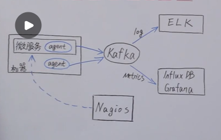
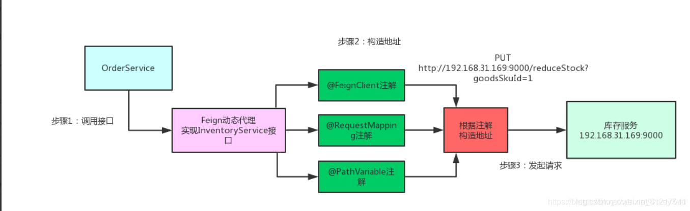
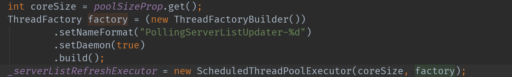
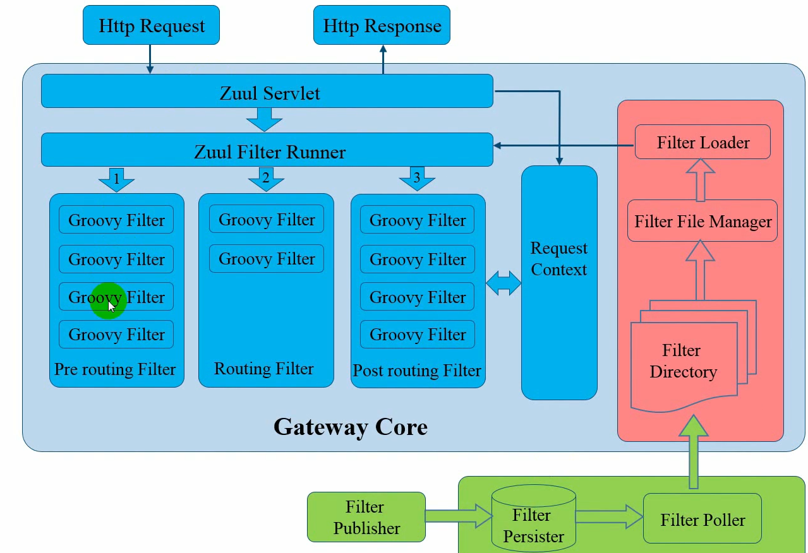
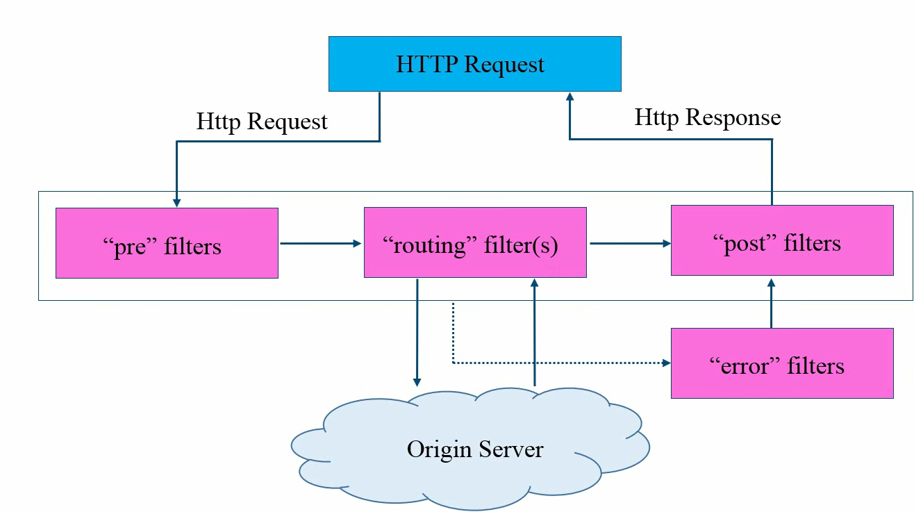
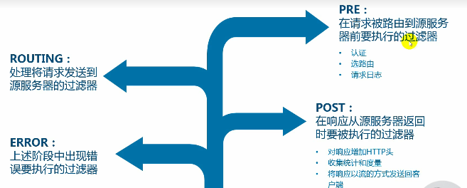
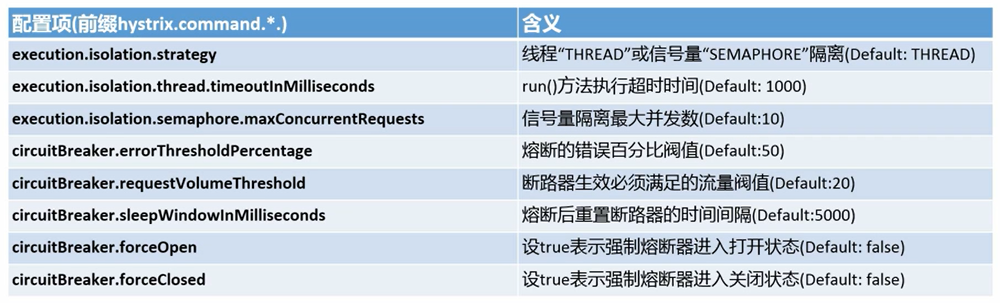
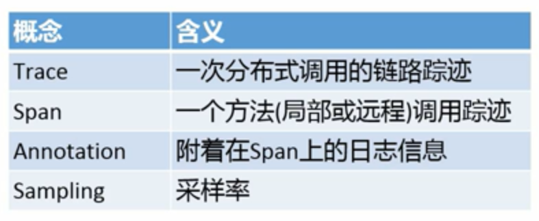
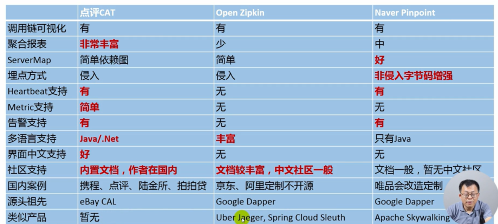

# 方法论

## 一、微服务架构

1.一组小的服务

2.独立的进程

3.轻量级通信

4.基于业务能力

5.独立部署

6.无集中式管理

## 二、微服务的利弊

1.利：

1）强模块化边界

2）可独立部署

3）技术多样性

2.弊：

1）分布式复杂性

2）最终一致性

3）运维复杂性

4）测试复杂性

<!-- more -->

## 三、康威法则：

设计系统的组织，其产生的设计和架构等同于组织的组织架构

## 四、引入微服务的时机：

业务规模的复杂性的增加导致单块服务不在适合，单块服务的开发会导致团队合作等一系列问题，最终导致生产力下降，交付能力、效率下降

1.单块优先 

2.商业价值被验证过可行

3.架构是演化出来的

## 五、什么样的组织架构更适合微服务

1.能够围绕微服务组织团队：产品、测试、研发（跨职能的，基于产品）

2.运维团队，可以交付平台产品（devops/网络等）（华为云、阿里云、腾讯云等公有云）

3.端到端的ownership，who build it,who run it（微服务团队，从设计、开发、review、测试、发布、支持形成闭环）

## 六、微服务的层次架构

6.接入层：APP/WEB

5.网关层：内部网关| H5网关| 无线网关| 第三方网关| 开放平台网关

4.业务服务层：基础服务-->聚合服务

3.支撑服务：注册发现| 集中配置| 容错限流| 认证授权| 日志聚合| 监控告警

2.平台服务：发布系统| 集群资源调度| 镜像治理| 资源治理| IAM

1.基础设施层：计算| 网络| 存储| NOC监控| 安全| IDC

微服务依赖：微服务开发框架| 持续交付流水线| 端到端的工具链| 工程实践与规范

## 七、网关

功能：1.反向路由

​    2.认证安全

​    3.限流熔断

​    4.日志监控

核心：是个servlet

## 八、微服务的监控

1.基础设施层监控：（网络、交换机）

网络流量| 丢包| 错包| 连接数等

2.系统层监控（物理机、虚拟机、OS）

CPU memory| network| disk等

3.应用层监控

URL| service| SQL| cache可用率| 响应时间| qps等

4.业务监控

核心指标监控| 登录注册| 下单| 支付等

5.端用户体验监控

性能| 返回码| 城市| 地区| 运营商| 系统版本等

## 九、监控模块

日志监控| metries监控| 健康检查| 调用链监控| 告警系统

# 各组件核心原理

## 一、Eureka：

1.Eureka Client：将服务的信息注册到EurekaService上，就是告诉EurekaService自己在哪台机器上、端口号是多少

2.Eureka Service：注册中心，里面有一个注册列表，保存了各个服务所在的ip和端口号

原理：服务启动后向Eureka注册，Eureka Server会将注册信息向其他Eureka Server进行同步，当服务消费者要调用服务提供者，则向服务注册中心获取服务提供者地址，然后会将服务提供者地址缓存在本地，下次再调用时，则直接从本地缓存中取，完成一次调用

当服务注册中心Eureka Server检测到服务提供者因为宕机、网络原因不可用时，则在服务注册中心将服务置为DOWN状态，并把当前服务提供者状态向订阅者发布，订阅过的服务消费者更新本地缓存。

**心跳检测机制****：服务提供者启动后，周期性（默认30秒）向Eureka Server发送心跳**，以证明当前服务是可用状态。Eureka Server在一定的时间**（默认90秒）未收到客户端的心跳**，**则认为服务宕机**，注销该实例。

**自我保护机制**：在默认设置中，Eureka Server在默认90秒没有收到客户端的心跳，则注销该实例，但是往往因为微服务跨进程调用，网络通信往往会面临着各种问题，比如微服务状态正常，但是因为网络分区故障时，Eureka Server注销服务实例则会让大部分微服务不可用，这很危险，因为服务明明没有问题。

为了解决这个问题，Eureka有自我保护机制，通过Eureka Server配置如下参数，可启动保护机制：

eureka.server.enable-self-preservation=true

它的原理是，当Eureka Server节点在短时间内丢失过多的客户端时（可能发生了网络故障），那么这个节点将进入自我保护模式，不再注销任何微服务，当网络故障恢复后，该节点会自动退出自我保护模式。

Eureka保证CAP中的ap

CAP:

C：一致性

A：可用性

P：分区容错，一般来说分布式系统是分布在多个位置的，因此一般认为分区容错性是不可避免的，所以P是必然存在的。

## 二、Feign：

首先，如果你的某个接口定义了@FeignClient注解，Feign就会针对这个接口创建一个动态代理（实现InventorySerivice接口），要调用哪个接口，本质上就是调用Feign创建的动态代理

Feign的动态代理会根据你在接口上的@RequestMapping等注解，动态构造出你要请求的服务的地址，然后针对这个地址发起请求，解析响应

## 三、Ribbon

功能：实现负载均衡，

1.默认使用RoundRibbon轮询算法

2.Ribbon会使用一个定时任务线程池，定时拉取更新数据

## zuul网关

**一条请求在网关中处理的声明周期**

网关的三个过滤器：前置路由过滤器，路由过滤器，后置路由过滤器

## Hystrix架构和实践

**一 基本的容错模式：**

1.超时：主动超时

2.限流：限制最大并发数

3.熔断：错误数达到阈值时，类似保险丝熔断

4.隔离：隔离不同的依赖调用

5.降级：服务降级

**二 容错理念：**

1.凡是依赖都可能会失败

2.凡是资源都有限制

CPU/Memory/Threads/Queue

3.网络并不可靠

4.延迟是应用稳定性的杀手

**三 弹性理念：**

对于系统来说，就是在发生容错限流之后的恢复能力，架构师需要弹性理念

**四 隔离机制：**

线程池隔离：

优点：1.支持排队和超时

​    2.支持异步调用

不足：线程调用会产生额外的开销（创建、管理线程池；线程的切换）

适用：1.不受信客户

​    2.有限扇出

信号量隔离：（简单理解就是一个计数器）

优点：轻量，无额外开销

不足：1.不支持任务排队和主动超时

​    2.不支持异步调用

适用：

1.受信客户（自己团队开发的项目，对其服务性能心里有数）

2.高扇出（网关）

3.高频告诉调用（cache）

**五 主要配置**

    

# 调用链监控

**一 产生背景**

1.线上发布了服务，怎么知道一切正常

2.大量报错，到底哪里产生的，谁才是根因

3.人工配置错误，通宵排错，劳民伤财

4.引用程序性能问题，怎么尽早发现

5.数据库问题，在出问题之前能洞察吗

**二 实践理论支持**

1.要提升，必须先测量；给开发人员一把测量反馈“尺”

2.研发自主监控：谁构建，谁运行，谁监控

**三 原理**

**四 相关产品的比较**

