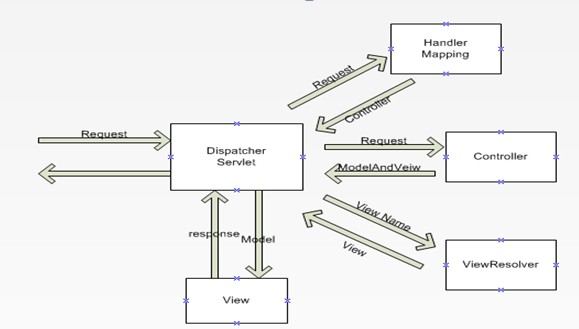

# SpringMVC的工作原理

1.用户发送请求至前端控制器DispatcherServlet

2.DispatcherServlet收到请求对URL进行解析，调用HandlerMapping处理器映射器

3.处理器映射器找到具体的处理器，生成处理器对象以及处理器拦截器，一并返回给DispatcherServlet

4.DispatcherServlet调用HandlerAdapter处理器适配器

5.HandlerAdapter经过适配调用具体的处理器（Controller）

6.Controller执行完成返回ModelAndView

7.HandlerAdapter将controller执行结果ModelAndView返回给DispatcherServlet

8.DispatcherServlet将ModelAndView传给ViewReslover视图解析器

9.ViewReslover解析后返回具体View

10.DispatcherServlet根据View进行渲染视图（即将模型数据填充至视图中）

11.DispatcherServlet响应用户

<!-- more -->

## 组件说明：

以下组件通常使用框架提供实现：

DispatcherServlet：作为前端控制器，整个流程控制的中心，控制其它组件执行，统一调度，降低组件之间的耦合性，提高每个组件的扩展性。

HandlerMapping：通过扩展处理器映射器实现不同的映射方式，例如：配置文件方式，实现接口方式，注解方式等。 

HandlAdapter：通过扩展处理器适配器，支持更多类型的处理器。

ViewResolver：通过扩展视图解析器，支持更多类型的视图解析，例如：jsp、freemarker、pdf、excel等。

### 组件：

**1、前端控制器DispatcherServlet（不需要工程师开发）,由框架提供**
作用：接收请求，响应结果，相当于转发器，中央处理器。有了dispatcherServlet减少了其它组件之间的耦合度。
用户请求到达前端控制器，它就相当于mvc模式中的c，dispatcherServlet是整个流程控制的中心，由它调用其它组件处理用户的请求，dispatcherServlet的存在降低了组件之间的耦合性。

**2、处理器映射器HandlerMapping(不需要工程师开发),由框架提供**
作用：根据请求的url查找Handler
HandlerMapping负责根据用户请求找到Handler即处理器，springmvc提供了不同的映射器实现不同的映射方式，例如：配置文件方式，实现接口方式，注解方式等。

**3、处理器适配器HandlerAdapter**
作用：按照特定规则（HandlerAdapter要求的规则）去执行Handler
通过HandlerAdapter对处理器进行执行，这是适配器模式的应用，通过扩展适配器可以对更多类型的处理器进行执行。

**4、处理器Handler(需要工程师开发)**
**注意：编写Handler时按照HandlerAdapter的要求去做，这样适配器才可以去正确执行Handler**
Handler 是继DispatcherServlet前端控制器的后端控制器，在DispatcherServlet的控制下Handler对具体的用户请求进行处理。
由于Handler涉及到具体的用户业务请求，所以一般情况需要工程师根据业务需求开发Handler。

**5、视图解析器View resolver(不需要工程师开发),由框架提供**
作用：进行视图解析，根据逻辑视图名解析成真正的视图（view）
View Resolver负责将处理结果生成View视图，View Resolver首先根据逻辑视图名解析成物理视图名即具体的页面地址，再生成View视图对象，最后对View进行渲染将处理结果通过页面展示给用户。 springmvc框架提供了很多的View视图类型，包括：jstlView、freemarkerView、pdfView等。
一般情况下需要通过页面标签或页面模版技术将模型数据通过页面展示给用户，需要由工程师根据业务需求开发具体的页面。

**6、视图View(需要工程师开发jsp...)**
View是一个接口，实现类支持不同的View类型（jsp、freemarker、pdf...）

**核心架构的具体流程步骤如下：**
1、首先用户发送请求——>DispatcherServlet，前端控制器收到请求后自己不进行处理，而是委托给其他的解析器进行处理，作为统一访问点，进行全局的流程控制；
2、DispatcherServlet——>HandlerMapping， HandlerMapping 将会把请求映射为HandlerExecutionChain 对象（包含一个Handler 处理器（页面控制器）对象、多个HandlerInterceptor 拦截器）对象，通过这种策略模式，很容易添加新的映射策略；
3、DispatcherServlet——>HandlerAdapter，HandlerAdapter 将会把处理器包装为适配器，从而支持多种类型的处理器，即适配器设计模式的应用，从而很容易支持很多类型的处理器；
4、HandlerAdapter——>处理器功能处理方法的调用，HandlerAdapter 将会根据适配的结果调用真正的处理器的功能处理方法，完成功能处理；并返回一个ModelAndView 对象（包含模型数据、逻辑视图名）；
5、ModelAndView的逻辑视图名——> ViewResolver， ViewResolver 将把逻辑视图名解析为具体的View，通过这种策略模式，很容易更换其他视图技术；
6、View——>渲染，View会根据传进来的Model模型数据进行渲染，此处的Model实际是一个Map数据结构，因此很容易支持其他视图技术；
7、返回控制权给DispatcherServlet，由DispatcherServlet返回响应给用户，到此一个流程结束。

下边两个组件通常情况下需要开发：

Handler：处理器，即后端控制器用controller表示。

View：视图，即展示给用户的界面，视图中通常需要标签语言展示模型数据。

## DispatcherServlet工作原理

1. 当DispatcherServlet接到请求时，他先回查找适当的处理程序来处理请求。DispatcherServlet通过一个或者多个处理程序映射，将每个请求映射到处理程序中。处理程序映射配置在web应用程序的上下文中，是实现了HandlerMapping接口的Bean。它负责为请求返回一个适当的处理程序（也就是Controller）。处理程序映射通常根据请求的URL将请求映射到处理程序（Controller）。 

2. 一旦DispatcherServlet选择了适当的控制器，它就会调用这个控制器来处理请求。 

3. 控制器处理完请求后，会将模型和视图名（有时候是视图对象）返回给DispatcherServlet。模型包含了控制器要传递给视图进行显示的属性。如果返回的是视图名称，它会被解析成视图对象再进行呈现。绑定模型和视图的基本类是ModelAndView

4. 当DispatcherServlet接收到模型和视图名称时，它会将逻辑视图名称解析成视图对象再进行呈现。DispatcherServlet从一个或者多个视图解析器中解析视图。视图解析器配置在Web应用程序上下文中，是实现了ViewResolver接口的Bean。它的任务是根据逻辑视图名称返回试图对象。 

5. 一旦DispatcherServlet将视图名称解析称为试图对象，它就会呈现视图对象，并传递控制器返回的模型。视图的任务是将模型属性展示给用户。 
