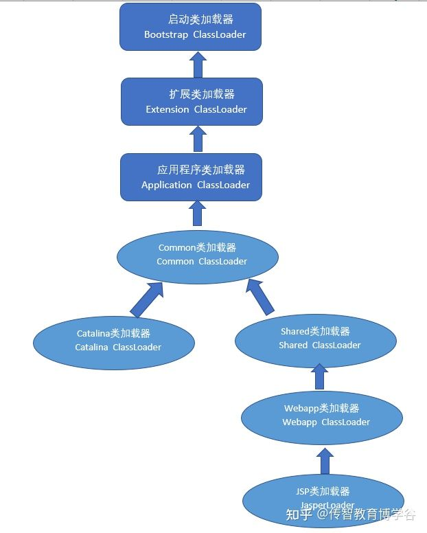

# Tomcat-为什么要JAVA破坏双亲委派机制

## 简述

- Tomcat本身也是一个Web应用程序
- 不同Web程序依赖不同，向上查询时可能导致依赖版本异常

打破双亲的机制，每个应用独立classloader其实自己做到隔离机制

<!-- more -->

## **类加载的本质是什么**

ClassLoader是用来加载 Class 的。它负责将 Class 的字节码形式转换成内存形式的 Class 对象。字节码可以来自于磁盘文件 *.class，也可以是 jar 包里的 *.class，也可以来自远程服务器提供的字节流，字节码的本质就是一个字节数组 []byte，它有特定的复杂的内部格式。

JVM 运行实例中会存在多个 ClassLoader，不同的 ClassLoader 会从不同的地方加载字节码文件。它可以从不同的文件目录加载，也可以从不同的 jar 文件中加载，也可以从网络上不同的静态文件服务器来下载字节码再加载

## **JVM 双亲委派机制**

Java1.2之后引入双亲委派模式 。

核心原理： 如果其中一个类加载器收到了类加载的请求，它并不会自己去加载而是会将该请求委托给父类的加载器去执行，如果父类加载器还存在父类加载器，则进一步向上委托，如此递归，请求最终到达顶层的启动类加载器。如果父类能加载，则直接返回，如果父类加载不了则交由子类加载，这就是双亲委派模式。

### 好处：

1. 向上委托给父类加载，父类加载不了再自己加载
2. 避免重复加载，防止Java核心api被篡改

类加载的分类：

- 分类

- - Bootstrap class loader：虚拟机的内置类加载器，通常表示为null ，并且没有父null
  - Platform class loader：平台类加载器,负责加载JDK中一些特殊的模块
  - System class loader：系统类加载器,负责加载用户类路径上所指定的类库

- 类加载器的继承关系

- - System的父加载器为Platform
  - Platform的父加载器为Bootstrap

## **Tomcat的 类加载顺序**

在Tomcat中，默认的行为是先尝试在Bootstrap和Extension中进行类型加载，如果加载不到则在WebappClassLoader中进行加载，如果还是找不到则在Common中进行查找 .

Common是公共的包， tomcat可以外挂很多个webapps (tomcat和app分开部署) ，优先以webapps下的为主。

tomcat7 —> 默认 WebappClassLoader 类加载器 tomcat 8 ---->默认 ParallelWebappClassLoader 类加载器

## **Tomcat要解决什么问题**

1. 一个web容器可能要部署两个或者多个应用程序，不同的应用程序，可能会依赖同一个第三方类库的不同版本，因此要保证每一个应用程序的类库都是独立、相互隔离的
2. 部署在同一个web容器中的相同类库的相同版本可以共享，否则，会有重复的类库被加载进JVM
3. web容器也有自己的类库，不能和应用程序的类库混淆，需要相互隔离
4. web容器支持jsp文件修改后不用重启，jsp文件也是要编译成.class文件的，支持HotSwap功能

### **Tomcat 可以使用默认的类加载机制吗答案是不行的。** **第一个问题，如果使用默认的类加载器机制，那么是无法加载两个相同类库的不同版本的，默认的累加器是不管你是什么版本的，只在乎你的全限定类名，并且只有一份。** **第二个问题，默认的类加载器是能够实现的，因为他的职责就是保证唯一性。** **第三个问题和第一个问题一样。** **第四个问题，我们想我们要怎么实现jsp文件的热修改，jsp 文件其实也就是class文件，那么如果修改了，但类名还是一样，类加载器会直接取方法区中已经存在的，修改后的jsp是不会重新加载的。那么怎么办呢？我们可以直接卸载掉这jsp文件的类加载器，所以你应该想到了，每个jsp文件对应一个唯一的类加载器，当一个jsp文件修改了，就直接卸载这个jsp类加载器。重新创建类加载器，重新加载jsp文件.** **Tomcat 如何实现自己独特的类加载机制？其实牛逼的Tomcat团队已经设计好了。我们看看他们的设计图**

**前面3个类加载和默认的一致，CommonClassLoader、CatalinaClassLoader、SharedClassLoader和WebappClassLoader则是Tomcat自己定义的类加载器，它们分别加载`/common/\*`、`/server/\*`、`/shared/\*`（在tomcat 6之后已经合并到根目录下的lib目录下）和`/WebApp/WEB-INF/\*`中的Java类库。其中WebApp类加载器和Jsp类加载器通常会存在多个实例，每一个Web应用程序对应一个WebApp类加载器，每一个JSP文件对应一个Jsp类加载器。**

- **commonLoader：Tomcat最基本的类加载器，加载路径中的class可以被Tomcat容器本身以及各个Webapp访问**
- **catalinaLoader：Tomcat容器私有的类加载器，加载路径中的class对于Webapp不可见**
- **sharedLoader：各个Webapp共享的类加载器，加载路径中的class对于所有Webapp可见，但是对于Tomcat容器不可见**
- **WebappClassLoader：各个Webapp私有的类加载器，加载路径中的class只对当前Webapp可见**

**从图中的委派关系中可以看出：**
**CommonClassLoader能加载的类都可以被Catalina ClassLoader和SharedClassLoader使用，从而实现了公有类库的共用，而CatalinaClassLoader和Shared ClassLoader自己能加载的类则与对方相互隔离。**
**WebAppClassLoader可以使用SharedClassLoader加载到的类，但各个WebAppClassLoader实例之间相互隔离。**
**而JasperLoader的加载范围仅仅是这个JSP文件所编译出来的那一个.Class文件，它出现的目的就是为了被丢弃：当Web容器检测到JSP文件被修改时，会替换掉目前的JasperLoader的实例，并通过再建立一个新的Jsp类加载器来实现JSP文件的HotSwap功能。**
**通过以上分析可知，子加载器优先于父加载器加载。即为了实现各个webapp的隔离性，webappClassLoader会先于父加载器加载，所以tomcat 确实违背了java 推荐的双亲委派模型机制。**

###### 来源：

https://zhuanlan.zhihu.com/p/478336170
