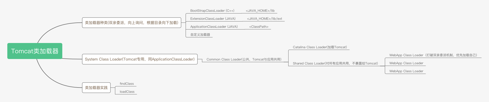

# Tomcat类加载器

## 类加载器种类(双亲委派，向上询问，根据目录向下加载)

### BootStrapClassLoader (C++)

&lt;JAVA_HOME&gt;/lib

### ExtensionClassLoader (JAVA)

&lt;JAVA_HOME&gt;/lib/ext

### ApplicationClassLoader (JAVA)

&lt;ClassPath&gt;

### 自定义加载器

## System Class Loader(Tomcat专用，同ApplicationClassLoader)

### Common Class Loader(公共，Tomcat与应用共用)

- Catalina Class Loader(加载Tomcat)
- Shared Class Loader(对所有应用共用，不暴露给Tomcat)
  - WebApp Class Loader1（打破双亲委派机制，优先加载自己）
  - WebApp Class Loader2
  - WebApp Class Loader3

## 类加载器实践

- findClass
- loadClass
