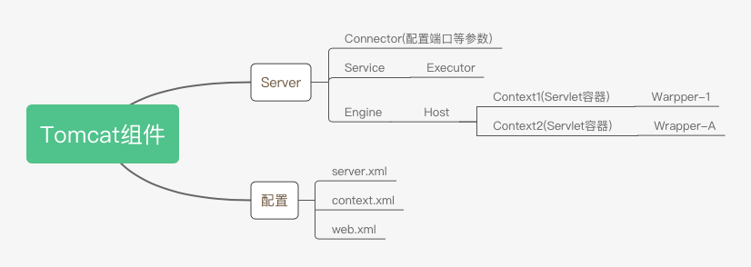

# Tomcat组件

## Server

- Connector(配置端口等参数)
- Service
  - Executor
- Engine
  - Host
    - Context1(Servlet容器)
      - Warpper-1
    - Context2(Servlet容器)
      - Wrapper-A

## 配置

- server.xml
- context.xml
- web.xml
