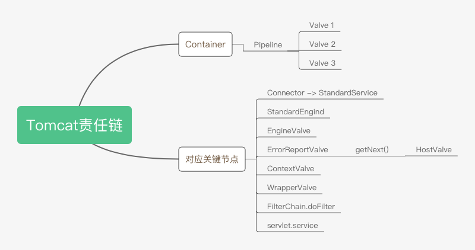

# Tomcat责任链

## Container

- Pipeline
  - Valve 1
  - Valve 2
  - Valve 3

## 对应关键节点

- Connector -&gt; StandardService
- StandardEngind
- EngineValve
- ErrorReportValve
  - getNext()
    - HostValve
- ContextValve
- WrapperValve
- FilterChain.doFilter
- servlet.service
