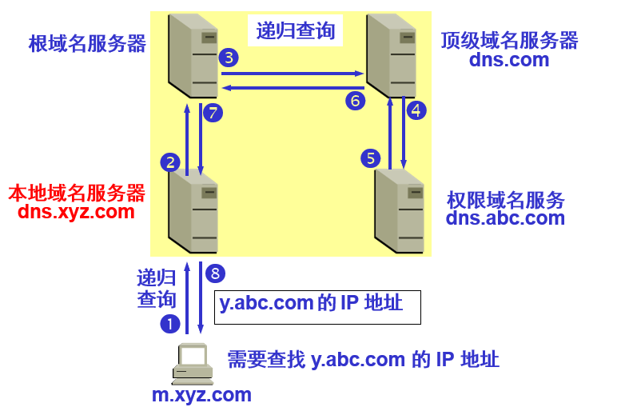
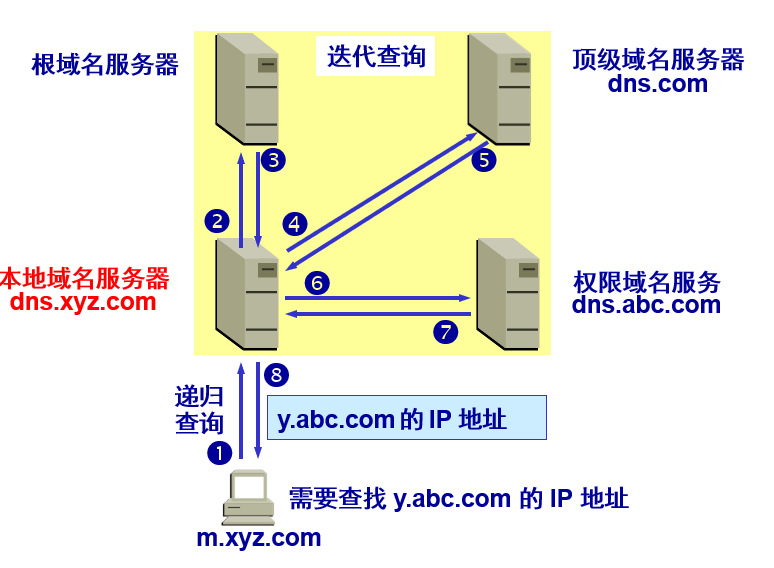

# DNS

主机向本地域名服务器查询一般采用递归查询
本地域名服务器向根域名服务器查询一般采用迭代查询

## 域名系统，Domain Name System

- 互联网采用层次结构的命名树作为主机的名字，并且使用分布式的域名系统DNS
  名字到IP地址的解析是由若干个域名服务器程序完成的
  	

## 递归查询

- 主机向本地域名服务器查询，查询不到则由本地域名服务器继续向上查询，直到查询到IP地址为止，后按查询路径返回
  	

## 迭代查询

- 主机向本地域名服务器查询，查询不到则由本地域名服务器继续网上查询，直到根域名服务器，如果查询不到，则返回主机的本地域名服务器，本地域名服务器继续向另一个上级域名服务器查询，直至根域名服务器。如此重复
