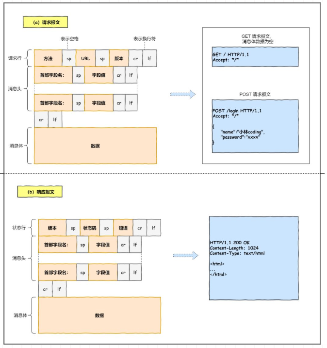

# HTTP(应用层)

- 超文本传输协议, 超文本包括文本、图片、视频、音频、压缩包等数据，基于请求/响应模型

## 报文格式

- 请求行/状态行
  - 方法 URL 版本
  - 版本 状态 短语
- 请求头/消息头
- 消息体

<!-- more -->

## 常见状态码

- 1XX， 提示信息，表示目前协议处理的中间状态，还需后续的操作，实际中用得比较少
- 2XX，表示成功，报文已被成功接收和正确处理
  		200（OK），最常见的状态码，表示一切正常。如果非HEAD请求，服务器返回的相应头都会由body数据
    		204（No Content），也是常见的成功状态码，与200基本相同，但响应头没有body数据
    		206（Partial Content），用于HTTP分块下载或者断点续传，表示响应返回的body数据并不是全部数据，而是其中一部分
- 3XX，表示客户端发送请求的资源发生了变动，需要客户端使用新的URL重新发送请求获取资源，即重定向
  		301（Moved Permanently），表示永久重定向，说明请求资源的资源已经不存在，需要改用新的URL再次访问
    		302（Moved Temporarily），表示临时重定向，说明请求的资源还在，但暂时需要使用另外的URL来访问
    		304（Not Modified），不具有跳转含义，表示资源未修改，重定向已存在的缓冲文件，也称缓存重定向
- 4XX，表示客户端发送的报文有误，服务器无法处理
  		400（Bad Request），表示客户端请求的报文有误，但具体什么错误并不知道
    		401（Unauthorized）,表示客户端没有访问的权限，需要进行身份认证
    		403（Forbidden），表示服务器禁止访问资源，并不是客户端的请求出错
    		404（Not Found），表示请求的资源不存在或未找到，所以无法提供给客户端
- 5XX，表示客户端的请求报文正确，但是服务器处理时内部发生了错误
  		500（Internal Server Error），表示服务器内部错误，但具体什么错误不知道
    		501（Not Implmented），表示客户端请求的功能还不支持
    		502（Bad Gateway），通常是服务器作为网关或代理时返回的错误码，表示服务器本身工作正常，但访问后端服务器发生了错误
    		503（Server Unavailable），表示服务器当前忙，暂无法响应
    		504（Gateway Timeout），网关超时

## 常见字段

- Host，指定服务器的域名
- Content-Length，服务器返回数据时，会有该字段，表明数据的长度
- Connection，常用于客户端要求服务器使用TCP连接，以便其他请求复用。HTTP1.1的连接默认都是持久连接，但为了兼容老版本需要指定未Keep-alive
- Content-Type，用于服务端响应时告诉客户端返回的数据类型
- Accept，表明自己接受的数据格式
- Content-encoding，说明数据的压缩方法
- Accpet-encoding，表明客户端接受的压缩方法

## GET 和 POST

- GET方法含义是从服务器获取资源（图片、文本、视频等），是幂等的，请求参数会拼接在URL
- POST方法是向URI指定的资源提交数据，数据放在body中

## 优缺点

- 优点
  	- 简单
   - 灵活和易于扩展
   - 应用广泛和跨平台

- 缺点

  - 无状态，服务不需要额外的资源来记录状态，可以减轻服务器的负担，但在完成有关联性的操作时会比较麻烦，每一次操作都需要验证信息

    - Cookie -- 保存在客户端

    - Session -- 保存在服务端

  - 明文传输，可能会被窃听，不验证通信方的身份，无法证明报文的完整性

## HTTP1.1

- 长连接，在HTTP1.0时，每发起一个请求都要建立一次TCP连接，而且是串行请求，断开时需要TCP断开连接，增加通信开销。为了解决这个问题HTTP1.1采用长连接的通信方式，减少TCP连接的重复建立和断开的开销。
  持久连接的特点时只要任意一方没有明确断开连接，则保持TCP连接状态
- 管道传输，长连接使得管道传输（pipeline）成为可能。同一个TCP连接里面，客户端可以发送多个请求，只要第一个请求发送出去后，不必等其回来就可以发送第二个请求减少整体的响应时间。但服务器还是会按请求的顺序响应
- 性能瓶颈
  - 队头阻塞，发送的请求当中，发送的第一个请求因为某种原因阻塞时，后面的请求会一同被阻塞
  - 请求/响应头部未经压缩就发送，首部信息越多延迟越大，只能压缩body部分
  - 没有优先级控制
  - 半工通信

## HTTP2

- 基于HTTPS的，安全有保障
- 改进
  - 头部压缩，HTTP/2会压缩头，如果同时发送多个请求，它们的头是一样的或是相似协议会帮忙消除重复部分。
    - HPACK算法，在客户端和服务端同时维护一张头信息表，所有字段都会存入该表，生成一个索引号，相同的头部就只发送索引号
  - 二进制格式，头和报文都是二进制格式，统称为帧
  - 数据流，HTTP/2的数据包不是按序发送的，同一个连接里面连续的数据包，可能属于不同的回应，因此需要对数据包进行标记属于哪个回应。
      	每个数据包/响应包成为一个数据流，每个数据流都有一个独一无二的编码，其中客户端发出的数据流编号为奇数，服务器响应的数据流为偶数。服务器优先响应优先级高的数据流
  - 多路复用，HTTP/2可以在一个连接中并发多个请求，而不需按顺序一一对应，移除了HTTP/1.1中的串行请求，提高连接利用率
  - 服务器推，服务器可以主动给客户端发送消息
- 缺点
      	- HTTP/2复用一个TCP连接，下层的TCP协议不知道上层有多少个HTTP连接，所以一旦发生丢包现象，就会触发TCP的重传机制，这样连接中的所有HTTP请求都必须等待这个丢了的包被重传回来

## HTTP3

- 把HTTP下层的TCP改成了UDP协议。UDP是不管顺序和丢包问题的，所以不会出现HTTP/1.1的对头阻塞问题和HTTP2的一个丢包全部重传问题
- QUIC类TCP可靠传输

## HTTPS

- 与HTTP区别
  - HTTP是超文本传输协议，信息是明文传输，存在安全风险。HTTPS则解决HTTP不安全的缺陷，在HTTP和TCP层之间加入了SSL/TLS协议，使得报文能够加密传输
    - 混合加密的方式实现信息的机密性，解决窃听风险
      - HTTPS采用的是对称加密和非对称加密的方式。
        在通信建立前采用非对称加密的方式交换会话密钥。公钥任意分发，私钥保密，结局密钥交换问题，但速度慢
        在通信过程中全部使用对称加密的会话密钥加密明文数据，只使用一个密钥，运算速度块，无法做到安全的交换密钥
    - 摘要算法的方式实现完整性，它能为数据生成独一无二得到指纹，用于校验数据的完整性，解决篡改风险
        			- 客户端发送明文前，通过摘要算法生成摘要，发送的时候把摘要和明文一同加密成为密文发送给服务器，服务器收到后，用相同的摘要算法算出发送过来的明文，通过对比摘要确保数据的完整性
    - 将服务器公钥放入数字证书中，解决冒充的风险
        			- 客户端先向服务器索要公钥，然后用公钥加密信息，服务器收到密文后，利用自己的私钥进行解密。公钥存放在数字证书中，只要证书可行，公钥就可信
  - HTTP连接建立相对简单，TCP三次握手后便可进行HTTP报文传输。而HTTPS在TCP三次握手后，还需进行SSL/TLS的握手过程，才可以进入报文传出过程
  - 端口不同
  - HTTPS需要向CA申请数字证书，用来保证服务器的身份是可信的
- 建立流程
  	- TCP三次握手
  - SSL/TLS握手 -- 客户端向服务器索要并验证服务器公钥，双方协商产生会话密钥，双方使用会话密钥进行通信
  - 
    - CilentHello
      首先由客户端向服务器发起加密通信请求，客户端向服务器发送
      1.客户端支持的SSL/TLS协议版本
      2.客户端产生的随机数（Client Radom），用于后面产生会话密钥
      3.客户端支持的密码套件列表，如RSA加密算法
    - ServerHello
      服务器收到客户端请求后，回应
      1.确认SSL/TLS协议版本，如果浏览器不支持，则关闭通信
      2.服务器产生的随机数（Server Random），后面用于产生会话密钥
      3.确认密码套件列表，如RSA算法
      4.服务器的数字证书
    - 客户端回应
      客户端收到服务器的回应后，通过浏览器或操作系统的CA公钥，确认数字证书的真实性。如果证书没问题，客户端会从数字证书中取出公钥，然后使用它加密报文，向服务器发送一个随机数、加密通信算法改变通知（表示后面使用会话密钥进行加密通信）以及握手结束通知
      这样服务器和客户端就同时会有三个随机数，接着双方就用协商的加密算法生成本次通信的会话密钥
    - 服务器最后回应
      服务器收到随机数（pre-master key）后，通过协商的加密算法生成本次通信的会话密钥，向客户端发送加密通信算法改变通知以及服务器握手结束通知

