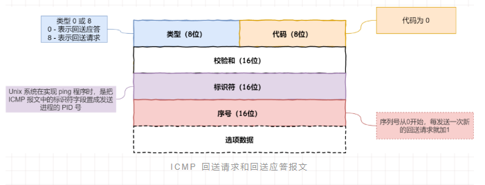

# IP

## 报文格式

- 版本，4bit
- 首部长度，4bit
- 服务类型TOS，8bit
- 总长度，16bit
- 标识，16bit
- 标志，3bit
- 片偏移，13bit
- TTL，8bit,每经过一次路由器就会减1
- 协议，8bit，如TCP（00001100）,ICMP(00000001)
- 首部校验和，16bit
- 源IP地址，32bit
- 目标IP地址，32bit
- 选项
- 数据

## ICMP（Internet Control Message protocol）,互联网控制报文协议

- 用于确认IP包是否成功送达目标地址，报告发送过程中IP被废弃的原因和改善网络设置等
  ​

- 查询报文类型

  标识符字段会记录由那个引用发送的ICMP包，同时选项数据中会记录发送时间，用于计算RT，说明路程的长短

  

  - 0-回送应答
    ​IP报文中的头部类型字段，会用0标识​
  - 8-回送请求
    ​IP报文中的头部类型字段，会用8标识
    ​		
    ​

- 差错报文类型

  - 3-目标不可达
    - IP路由器无法发送IP数据包给目标地址时，会返回发送端主机一个目标不可达的ICMP消息，并将不可达原因记录在IP报文的代码字段
      ​0-网络不可达，路由表匹配不到对方的IP
      ​1-主机不可达，路由表没有主机的信息或者主机未连接网络
      ​2-协议不可达，如使用TCP访问对方主机时，能找到主机，但是TCP协议已被禁用
      ​3-端口不可达，对方主机没有监听对应的端口
      ​4-需要设置分片但设置了不分片
    
  - 4-远点抑制，增大IP数据包的传输间隔，缓和网络拥堵
  - 5-重定向或改变路由
  - 11-超时， TTL减为0时，数据包将被丢弃，会向发送方发送一个ICMP消息

- Ping命令

## IGMP

### V1

#### 优点

IGMPv1一共有**两种报文**，普查报文和成员报告报文，没有离组报文。

IGMPv1**只有一种机制**，响应抑制机制，没有离组机制。

#### 缺点

IGMPv1**没有查询器选举机制**，需要PIM的DR来充当IGMPv1的查询器。

IGMPv1**没有离组机制，对流量的控制性不好**。

###### 来源：

https://zhuanlan.zhihu.com/p/387885523
