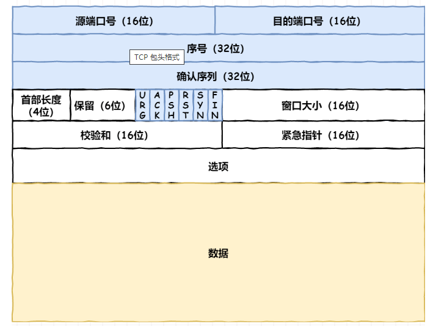
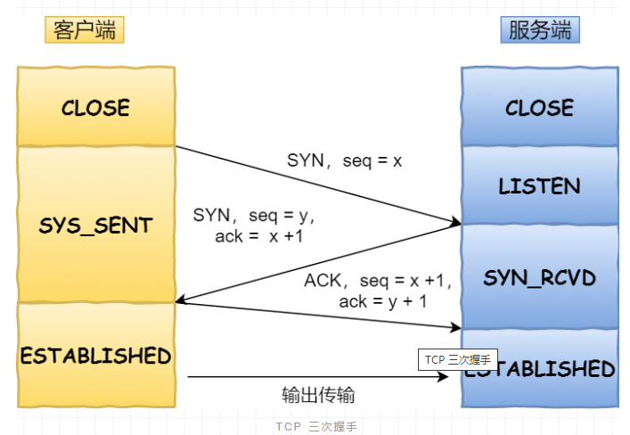
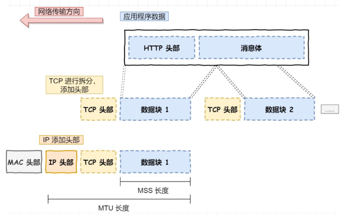
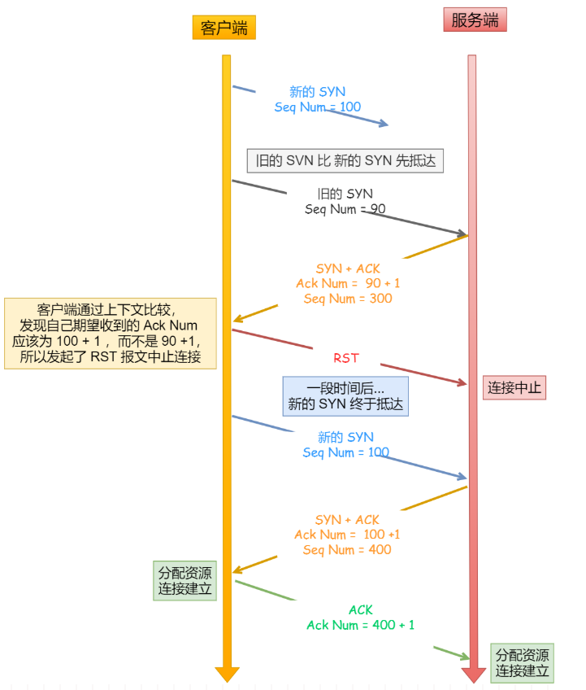
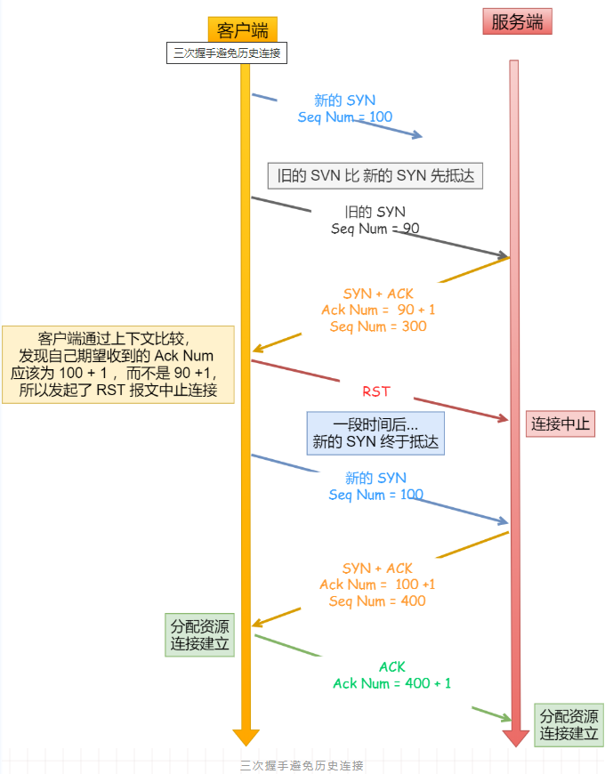
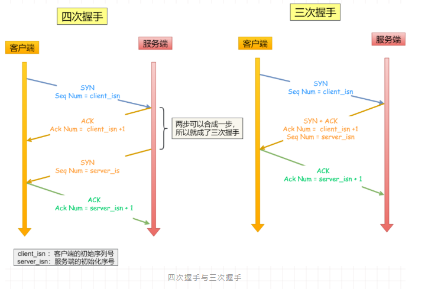
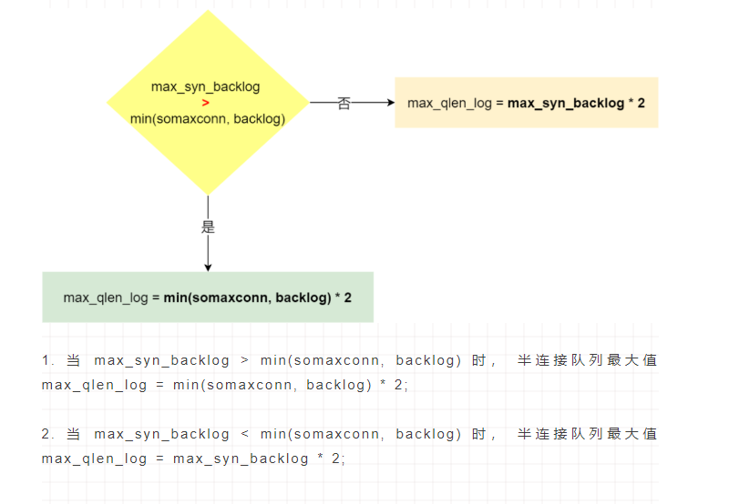
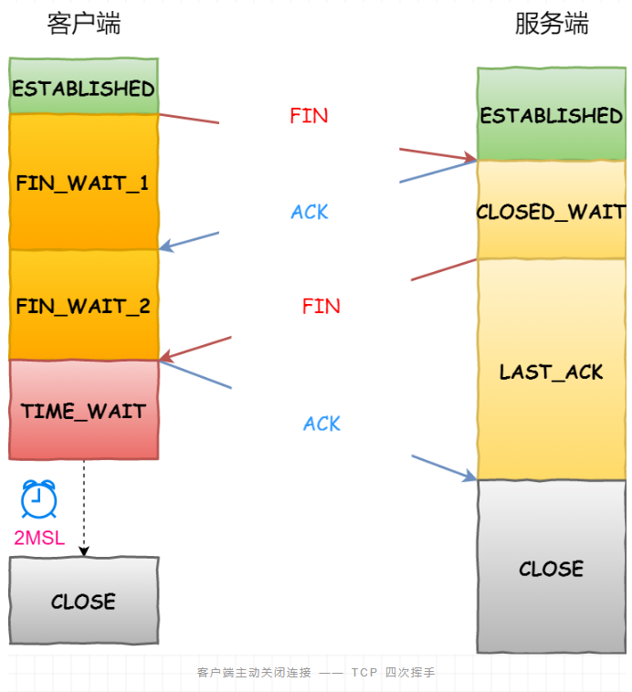
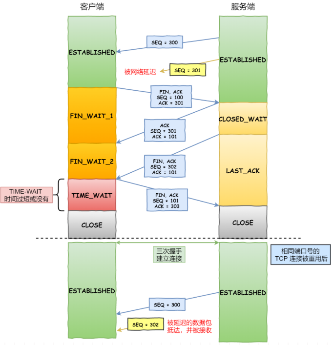

# TCP

- 面向连接的、可靠的、基于字节流的传输层协议
  - 面向连接是指一对一
  - 可靠的是指无论网络链路中出现怎样的变化，TCP都可以保证一个报文一定能够到达接收端
  - 消息时没有边界的，多大都可以传输。消息时有序的

<!-- more -->

## 报文格式

- 源端口，16bit
- 目的端口，16bit
- 序号，32bit，解决包乱序问题，由于网络原因，最先发送的数据包可能不是最先到达的，以及多个数据包组合
- 确认序列，32bit
- 首部长度，4bit
- 保留，6bit
- URG，1bit,是否紧急
- ACK，1bit，确认应答，除最初建立连接时的SYN包之外改为必须设置为1
- PSH，1bit
- RST，1bit,连接重置，表示TCP连接中出现异常必须强制断开连接。
- SYN，1bit,表示希望建立连接
- FIN，1bit，表示终止连接，今后不会再有数据发送
- 窗口大小，16bit，用于流量控制和拥塞控制
- 校验和，16bit
- 紧急指针，16bit
- 选项
- 数据

## 三次握手

- 客户端

  - SYN_SENT

    - 客户端一开始处于CLOSE状态，服务端处于LISTEN状态

    - 客户端主动发起连接SYN，之后处于SYN_SENT状态。发起连接时会携带几个信息：

      1.SYN
      2.seq = x, x代表发送的报文的序列号

  - ESTABLISHED
    - 客户端收到服务端发送的SYN和ACK确认之后处于ESTABLISHED，连接建立状态
      
      - 同时会像服务端发送第三次握手报文，携带以下信息：
        1.ACK
        2.seq=x+1，本次报文的序列号
        3.ack=y+1，表示对服务端序列号y的报文确认，同时期望下一次报文的序列号为y+1
      
  
- 服务端
      - LISTEN
        服务端一开始是处于LISTEN状态，监听某个端口
      - SYN_RECEIVED
        - 服务端收到发起的连接，返回SYN和ACK确认客户端的SYN，之后处于SYN_RECEIVED状态
        - 服务端响应报文会携带：
          1.SYN
          2.ack = x + 1， 代表对客户端的序列号x的报文确认，同时期望下一次报文的序列号为x+1
          3.seq = y，代表服务端发送的报文的序列号
      - ESTABLISHED
        服务端收到客户端的ACK之后，处于ESTABLISHED，连接建立状态
  
- MTU,最大报文长度（IP层报文），以太网中一般为1500字节

- MSS，除去IP和TCP头部，一个数据包所容纳的TCP数据的最大长度，如果请求消息超过MSS，TCP会对数据进行分割后发送，分割后的数据会被封装成TCP数据包拼接上IP头部由IP层进行发送，到达数据链路层拼接MAC头继续交给物理层通过网卡进行发送

  - 为什么不由IP层进行分片？
    因为IP层没有重传机制，如果IP层分片，那IP数据包分片有一个丢失没有收到TCP就会不响应，发送方就要重传，那就需要重传所有的数据，因为是IP层分片的

- 为什么是三次握手而不是两次或四次？

  

  - 防止历史连接初始化

    - 客户端连续多次发送SYN建立连接的报文，在网络拥堵的情况下：
      一个旧的SYN报文会比新的的SYN报文早到达服务端，那么此时服务端就会回复一个SYN+ACK给客户端，客户端收到后根据自身的上下文，判断这是一个历史的连接（序列号过期或者超时），那么客户端就会发送RST报文给服务端，表示终止此连接
      
      
      
    - 如果是【两次握手，就不能判断当前连接是否为历史连接】，三次握手则可以在客户端准备发送第三次报文时，来判断
      如果是历史连接（序列号过期或超时），则第三次发送RST报文终止连接
      如果不是则发送ACK报文建立通信

  - 同步双方序列号
    接收方可以根据序列号可以去除重复数据和按序列号进行顺序接收
    可以标识已发送的数据包哪些被接收
    			
    四次握手也可以同步序列号，但服务端对客户端的SYN报文的确认可以和自己发送给客户端的SYN报文进行合并
    而两次握手只能保证客户端的初始序列号被对方成功接收，不能保证服务端的初始序列号都能被确认接收

    

  - 避免资源浪费
    如果两次握手，当客户端的SYN请求连接报文在网络中阻塞，客户端没有收到ACK报文，机会重新发送，由于没有第三次握手，服务端不清楚客户端是否接收到自己的ACK报文，所以每收到一个SYN就只能先主动建立一个连接，那么服务器就会建立多个冗余的无效连接，造成资源浪费
    		

    

- 初始序列号如何产生的？
    它是基于时钟的，每4毫秒就 + 1，转一圈就需要4.55个小时（2^32 / 4）
    RFC1948提出了一个算法每4毫秒+ 1 再加上由源IP、源端口、目的IP、目的端口经过hash得出的随机数
    
- SYN攻击
  - TCP建立连接处理正常流程
    
      1.服务端收到客户端SYN报文时，会将其加入到内核的SYN队列
    
      2.接着发送SYN+ACK给客户端，等待客户端回应ACK报文
    
      3.服务端接收ACK报文后，从SYN队列移除，放入Accept队列
    
      4.应用通过调用accept()方法从accept队列取出连接
    
      - 如果应用程序过慢就会导致Accept队列占满，沾满后就会丢弃后面的连接
      - 如果收到SYN攻击就会导致SYN队列占满
      
  - TCP建立连接需要三次握手，假设攻击者短时间内伪造不同IP地址的SYN报文，服务端每收到一个SYN报文都会响应，进入SYN_RECEIVED状态，但得不到伪造的IP地址的应答，最终占满服务端的SYN连接队列（未连接队列），使得服务器不能正常为正常用户服务
    
  - 如何避免
    
      - 修改Linux内核参数，控制队列大小和队列满之后的处理
        
          - 通过net.core.netdev_max_backlog 调整队列大小
          
          - 通过net.ipv4.tcp_max_syn_backlog 和 net.core.somaxconn 控制最大SYN_RECEIVED状态的最大连接数
          
            - 半连接长度计算方式
          
              1.如果当前半连接队列长度 <= 理论半连接队列长度，但是超过max_syn_backlog的3/4，那么处于SYN_RECEIVED状态的最大个数就是max_syn_backlog的3/4（max_syn_backlog-(max_syn_backlog >> 2)）
          
              2.如果当前半连接队列长度 > 理论半连接队列长度，那么处于SYN_RECEIVED状态的最大个数就是理论半连接队列长度
               计算理论半连接队列长度（max_qlen_log）需要使用somaxconn
          
              				

          - 通过net.ipv4.tcp_abort_on_overflow = 1设置超出处理能力时，对新的SYN直接返回RST，丢弃连接.设置为0时，如果队列满了就会丢掉客户端的ACK，但客户端会进入建立状态，只要服务端不回复，就会一直重发请求，直至队列有空位，会造成短暂的网络繁忙

      - 控制半连接队列（SYN队列）满之后，直接进入已完成连接队列（Accept队列）
      
          - 半连接队列满了之后会先判断有没有开启tcp_syncookies，没有开启则会直接丢弃
      
            否则如果全连接队列满了也会丢弃
      
            根据max_syn_backlog判断，如果当前半连接长度小于max_syn_backlog的3/4则丢弃
      
          - 设置 net.ipv4.tcp_syncookies = 1
      
            1.当SYN队列满之后，后续服务器收到SYN包，不进入SYN队列
      
            2.计算出一个cookie值，再以SYN+ACK中的序列号返回客户端
            3.服务端接收客户端应答报文时，检查ACK包的合法性，如果合法则直接放到Accept队列

      - 减少SYN+ACK重传次数，设置net.ipv4.tcp_synack_retries， 可以加快处于SYN_RECEIVED状态的连接加速断开，因为处于这个状态的连接会重传SYN+ACK，达到一定次数后就会断开连接

## 四次挥手

- 客户端

  - FIN_WAIT_1
    客户端打算关闭连接，此时会发送一个TCP首部FIN标志控制位设置为1的报文，即FIN报文，之后客户端就进入FIN_WAIT_1状态

  - FIN_WAIT_2
    客户端收到服务端的ACK报文后，进入FIN_WAIT_2状态

  - TIME_WAIT
    客户端回复ACK报文对服务端的FIN报文进行应答后，进入TIME_WAIT状态，等待两个报文时间（2MSL）

  - CLOSED

    客户端经过2MSL等待时间后，进入CLOSED状态

- 服务端

  - CLOSED_WAIT
    服务端收到FIN报文后，就向客户端发送ACK，表示已收到关闭连接请求，但不会立刻关闭，因为可能还有数据要进行传输，会进入CLOSED_WAIT状态，半关闭
  - LAST_ACK
    服务端处理完数据之后，会发送FIN报文给客户端，进入LAST_ACK状态，等待客户端确认关闭连接
  - CLOSED
    服务端收到ACK应答后就进入CLOSED状态了

- 为什么需要四次挥手？

  - 关闭连接时，客户端给服务端发送FIN报文时仅仅表示客户端不再发送数据了，但可能还需要接收数据
  - 服务端收到客户端FIN报文时，想回复一个ACK应答报文，而服务端可能还有数据需要处理和发送，等服务端处理完之后才发送FIN给客户端表示同一现在关闭连接。所以服务端的FIN和ACK需要分开发送

- TIME_WAIT为什么需要2MSL？

  - MSL指最大报文生存时间，它是任何报文在网络上存在的最长时间，超过这个时间将丢弃。MSL单位是时间，而IP报文首部的TTL单位是跳数，所以MSL应该大于等于TTL降为0的耗时，以确保报文已被自然消亡
  - 确保服务端能正确收到last ack关闭连接
    - 网络中存在来自发送方的数据包，但这些发送方的数据包被接收方接收并处理后又响应发送方，所以一来一回就需要2MSL
    - 如果被动关闭方没有收到断开连接的ACK报文，就会触发超时重传FIN报文给客户端，客户端收到FIN报文后，又重新发送ACK给服务端，这样一来一回就2MSL。Linux系统time wait时间为60秒

- 为什么需要TIME_WAIT状态

  - 防止具有相同四元组的【旧】数据包被收到

    - 假设连接关闭前，有一个数据包因为网络原因没有延迟到达接收方，此时双方经过四次挥手断开了连接
      一段时间收，具有相同ip和端口号的请求通过三次握手重新建立了连接
      刚好前一个连接的请求此时到达了，碰巧序列号就是接收方期望的序列号，那么就有可能会被正确接收，产生数据错乱

      

    - 所以需要等待2MSL让其在网络中自然消亡，保证原连接的数据都消亡了，新连接不会出现旧连接的数据包

  - 保证被动关闭的一方能被正确关闭，即保证最后的ACK能让被动关闭的一方接收

    - 如果发起关闭方的最后的ACK丢失，如果TIME_WAIT过短或没有，那么发起方就会直接进入到CLOSED状态，服务端由于没有收到ACK会一直处于LAST_ACK状态
      当客户端发起建立连接的SYN请求后，服务端就会回复RST报文，拒绝建立连接

- TIME_WAIT过多会怎样？
  1.占用内存资源
  2.占用端口资源，如果端口被占满之后，就会导致无法创建新连接

  - 优化方式
    - 打开net.ipv4.tcp_tw_reuse  = 1和net.ipv4,tcp_timestamps = 1，设置tw_reuse需要先打开timestamps时间戳支持。
      TCP头部的【选项】字段就会记录发送方的当前时间的时间错和从对端接收到的最新时间戳，由于引入了时间戳，2MSL问题就不复存在，因为重复的数据包就会因为过期而丢弃
      需注意客户端和服务端主机的时间同步问题，如果不同步客户端发送的消息会被直接拒绝掉
    - 设置net.ipv4.tcp_max_tw_buckets，超过该值就将系统中所有处于TIME_WAIT的连接重置
    - 程序中使用SO_LINGER，应用强制使用RST关闭
      设置socket选项中的so_linger.l_onoff 非0且so.linger.l_linger非0，那么调用close后就会跳过TIME_WAIT直接RST连接

## 可靠传输

## 性能优化

- 三次握手过程
  	调整SYN报文重传次数，tcp_syn_retries
    调整SYN半连接队列大小，tcp_max_syn_backlog和somaxconn， tcp_syncookies直接进入全连接队列
    调整SYN+ACK报文重传次数，tcp_synack_retries
    调整Accept队列长度，tcp_max_syn_backlog和somaxconn， 设置队列溢出的处理，tcp_abort_on_overflow
    绕过三次握手，tcp_fastopen，主要利用cookie，类似tcp_syncookies
- 四次挥手过程
  	调整FIN报文重传次数,tcp_orphan_retries
    调整FIN_WAIT_2状态时间，tcp_fin_timeout
    调整孤儿连接的上限，tcp_max_orphan 如果tcp_max_orphan < tcp_orphan_retries就会直接RST，跳过四次挥手
    调整time_wait状态的上限个数，tcp_max_tw_buckets
    复用time_wait状态连接，tcp_tw_reuse和tcp_tw_recyle(需开启时间戳支持)
   - tcp_tw_reuse它还可以防止序列号绕回，因为序列号是32bit
   - tcp_tw_recycle 在使用了 NAT 的网络下是不安全的
     - PAWS(使用reuse和recycle 复用之前连接时，会保存的最近一次收到数据的 Timestamp。 reuse记录的最近一次收到数据的Timestamp是针对Per-Connection的，而recycle记录的最近一次收到数据的 Timestamp 是针对Per-Host)
       - 它能在序列号绕回时 ，识别出数据包是过期的数据包。因为可能是延迟到达的数据包，并且序列号正好是期望的序列号
      - 在开启tcp_timestamps情况下，TCP数据包会带上时间戳，PAWS要求连接双方维护最近一次收发数据包的时间戳，每次收到数据包都会读取其中的时间戳，跟自己维护的最近收发数据的时间戳比较，发现数据包中的时间戳不是递增的就丢弃掉
      - tcp_tw_recycle 的 per-host 是对「对端 IP 做 PAWS 检查，NAT环境下IP地址是相同的，如果多个客户端的时间不同步会出现拒绝建立连接问题
- 传输过程
  扩大窗口大小
  调整发送缓冲区范围
  调整接收缓冲区范围
  接收缓冲区动态调节
  调整内存范围

## 有一个IP的服务器监听了一个端口，它的最大TCP连接数是多少

- 最大TCP连接数 = 客户端的IP数*客户端的端口数
  对于IPv4，客户端IP数据最多为2^32，端口数为2^16,因此最多的连接数为2^48
  服务端最大并发TCP连接数远不能达到理论上限，首先是文件描述符限制，另一个是内存限制

## 什么情况下syn丢包

- 半连接队列/全连接队列满
- 开启了tcp_tw_reuse/tcp_tw_recyle 和tcp_timestamps 
